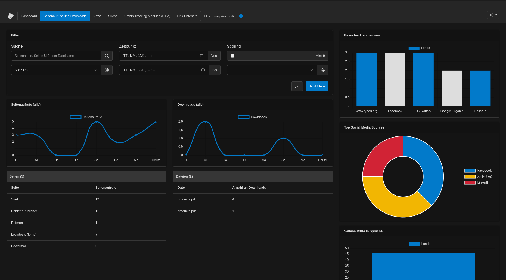

# Living User eXperience - LUX - the Marketing Automation tool for TYPO3

LUX is an enterprise software solution that bridges the gap between your TYPO3 website and standalone marketing
automation tools. LUX tracks, identifies and analyzes your leads while providing visitors with an improved user
experience by showing relevant information at the right time.

In addition, with **LUXenterprise** you can use this data even more effectively by nurturing leads, running A/B tests
and using URL shorteners.

Or see interesting information of your visitors by extending data automatically via a GDPR-conform solution from
**WiredMinds**

## [Privacy documentation](Privacy/Index.md)
See some basic hints to respect visitors privacy and follow the rules of GDPR (General Data Protection Regulation)
/ DSGVO (Datenschutzgrundverordnung).

## [Marketing documentation](Marketing/Index.md)
We want to give you hints from time to time to get best results with your marketing automation tool.

## [Technical documentation](Technical/Index.md)
A fully technical documentation how to install, configure and extend lux to your needs.

## [Developer documentation](Developer/Index.md)
How to develop with LUX and LUXenterprise
