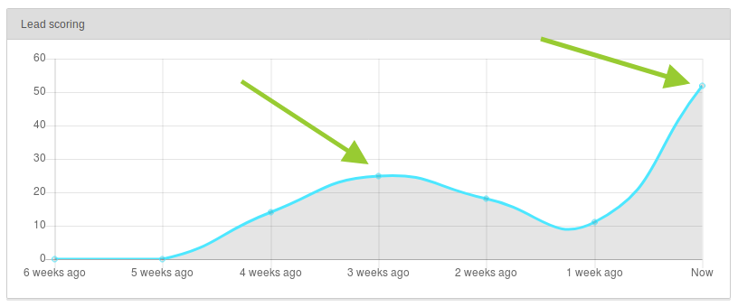
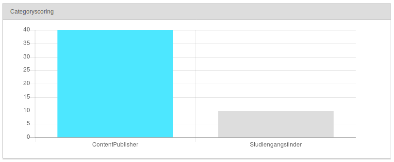
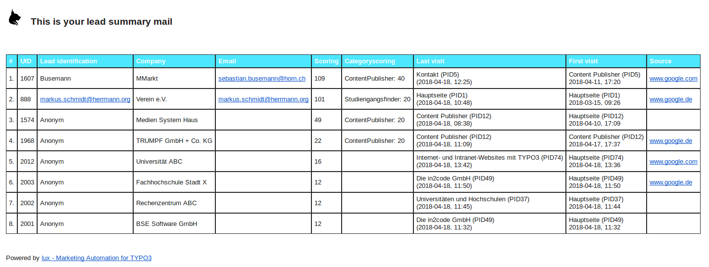
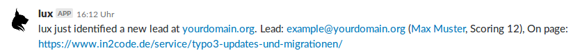

## Marketing documenation

We're going to update this documenation from time to time to give you some hints how to use LUX or a marketing
automation tool to get best results.

### Glossary

First of all, let's define some terms in marketing automation and in LUX. This will help you with this manual and
simplifies the work with marketing automation tools in general.

| Term                | Description                                                                                                                                                                                                                                                                                                                                                                              |
|---------------------|------------------------------------------------------------------------------------------------------------------------------------------------------------------------------------------------------------------------------------------------------------------------------------------------------------------------------------------------------------------------------------------|
| Category-Scoring    | While a scoring tells us if a lead is hot, we still don't in which product or service the lead is interested in. Here comes the category scoring. You can have unlimited categories and a scoring related to category with **Product A** will tell us, if the lead is interested in the product. A category-scoring will not decrease, even if the visit was some time ago.        |
| Cookie              | A cookie is an individual value that is saved in the visitors browser. LUX can be run without cookies.                                                                                                                                                                                                                                                                                   |
| LocalStorage        | A local storage is similar to a cookie but a bit of a newer technology.                                                                                                                                                                                                                                                                                                                  |
| DoNotTrack          | Browser support a *DoNotTrack* setting. This setting must be turned on from the user (it is not a default setting of the browser). If LUX recognize this setting, all tracking functions are disabled. We will respect this privacy setting!                                                                                                                                             |
| Email4link          | Email4link is a LUX feature where you can ask your leads for their email if they want to download something.                                                                                                                                                                                                                                                                             |
| Fingerprinting      | We can recognize visitors by their complete hard- and software usage - a values build from all this settings is an unique fingerprint. This is an anonymized hash that allows LUX to recognize the visitor by further visits in the future.                                                                                                                                              |
| Identified Lead     | An identified lead means, that we know his/her email address.                                                                                                                                                                                                                                                                                                                            |
| Lead identification | This is a virtual field of the lead and is used in the lead backend module and on some other places of LUX. Depending on the information that we have, we show the email or the first- and lastname or simply "Anonymous" if the lead is still not identified.                                                                                                                           |
| Link Listener       | Since version 9 LUX supports Link Listeners. You can listen to clicks on "call to action" buttons for an individual performance analysis. In addition clicks on Link Listeners can increase a category scoring of a visitor                                                                                                                                                              |
| Nurturing           | Lead-Nurturing means to develop a lead. Tell your leads relevant information and let them know how your business could help them. If you do this step by step, you will develop your leads - you will nurture your leads.                                                                                                                                                                |
| Lead                | A lead is a potential new customer for your business. No matter if you sell products or services.                                                                                                                                                                                                                                                                                        |
| LUX                 | Living User eXperience - the Marketing Automation tool for TYPO3                                                                                                                                                                                                                                                                                                                         |
| Opt In              | LUX is disabled as long as a visitor accept a message (e.g. in a modal) or the privacy statement.                                                                                                                                                                                                                                                                                        |
| Opt Out             | LUX is enabled by default and can be disabled from a visitor over the opt out plugin.                                                                                                                                                                                                                                                                                                    |
| Scoring             | A scoring is a value related to a lead, where we want to see **how hot this lead is**. This means: The more scoring the lead have, the more business-relevant is this lead. So, scoring is just a factor for us to see how interested the lead is - or if the lead wants to do business with us. A scoring can also decrease if the last visit from the lead was some time ago. |
| Slack               | Slack is a chat platform. Mainly used for team-communication and loved by developers. There is a *Publish to a slack channel* workflow action available in LUX.                                                                                                                                                                                                                          |
| Visitor             | A visitor is a website-visitor. This could be a lead or just someone who comes to your site and leaves at once because he/she was wrong                                                                                                                                                                                                                                                  |
| Workflow            | A workflow is a combination of one or more triggers and one or more actions to nurture your leads.                                                                                                                                                                                                                                                                                       |
| Workflow Action     | An action will be executed if a trigger fits. A known action could be to open a lightbox for the visitor.                                                                                                                                                                                                                                                                                |
| Workflow Trigger    | A trigger is a point of action this will cause an action. A known trigger could be e.g. *the second website visit*.                                                                                                                                                                                                                                                                      |

### Identification

This part of the documentation describes different possibilities to **identify your leads**.
Identification means that you are able to know the person behind the lead.
And this needs an unique identification-property from the lead.
E.g. firstname would be - of course - not a good property because this is not unique.
Marketing Automation tools are going to use the **email-address** as unique property of the user.
And... emails are great because, you can:

* identify the lead
* see the firstname as part of the email address (mostly given in business cases)
* see the lastname as part of the email address (mostly given in business cases)
* see the company as part of the email address (mostly given in business cases)
* having an url (company) where you can simply find more interesting stuff of your lead
* send marketing relevant information in newsletters

So, if email-addresses are great and we want to collect the email from our unknown leads - how can we do this? The
answer is simple: We have to deal a bit with our visitors. Let them download an interesting asset (e.g. a whitepaper)
but ask for their email address first. Another way would be to offer a callback-form where you offer to call the
visitor - also ask for the email address here. Is there a form, where the visitor can get access to a software?
You guessed it, ask for the email address.

A good percentual value would be an identification rate of 1% of all your visitors.
So check the LUX dashboard and decide to make more *deals* if the value is too low.

See more technical details in documenation part [Identification](../Technical/Identification.md)

### Lead nurturing

Think about the customer livecycle and try to develop your leads. There are a few possibilities of nurturing like
storytelling (tell your visitors a story to let them understand the problems they have and the solution you are
offering), contextual content (show only relevant content for the needs of your visitors) or open a lightbox with a
special offer if the lead visits your product the second or third time.

### Cold calling - tipps and tricks

#### Understanding the diagrams

When is the **perfect time for a cold call**? LUX will help you to show the relevant information you or yours sales
need.
In the following example you will see the scoring of a potential new customer. There are two visible peaks in the
diagram. Every peak reflects a perfect time for a cold call because this is the time when the lead shows activity on
your website and this means - he/she is interested in your company, your products or your service.
The visible drop in the diagram reflects a time when the visitor is too busy or maybe not interested any more. So don't
miss the perfect time.

The categoryscoring diagram shows you in which product the lead is interested in. So this will help you to offer your
potential customer the right product.

#### Getting informed

##### Via Email
You can set up a lead summary mail (e.g. frequently every monday) with the last visitors and there companies.
This means, you don't have to log in into TYPO3 and see the important information in your mail client (e.g. Outlook).

#### Via internal chat
If you're using an internal tool like slack for your team-communication, you can set up an own workflow to get
informed if there is an interesting lead on your website. Even if it is not identified it's possible to see relevant
information like the companyname or the location.

