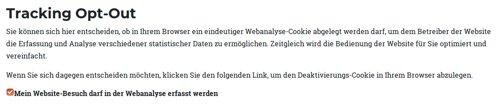
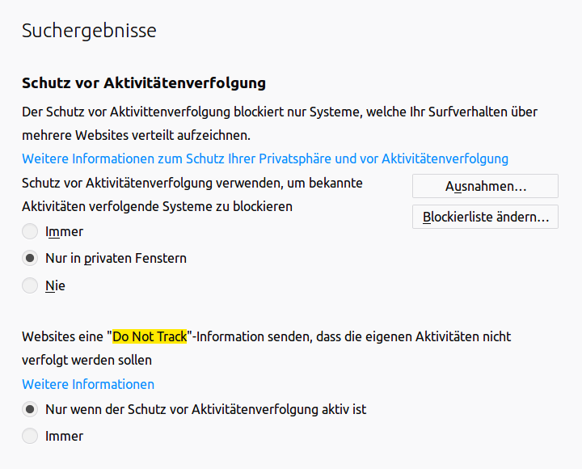

This part of the documentation gives you some information about privacy on websites in general.

## Privacy documentation

Lux respects the privacy protection of website visitors. Please follow our example.

First of all let your visitors know what kind of information you are collecting and why you are collection those
information and where the information is stored (not on a third party companies server but on your server!).
The best place for this explanation is the privacy site (Datenschutzerklärung). This will follow the
rules of GDPR (General Data Protection Regulation) / DSGVO (Datenschutzgrundverordnung).

### Example part for your privacy page

This could be an example for your German "Datenschutzerklärungsseite". This is not a legal binding declaration.

```
<h2>Verwendung des Marketing-Automation-Tools lux</h2>

Diese Website benutzt das Marketing-Automation-Tool lux. Lux verwendet keinerlei Cookies.
Einige benutzerdefinierte Einstellungen, die keinen Rückschluss auf den Besucher zulassen, werden in den Bereich
"Localstorage" des Browsers zwischengespeichert und werden benötigt, um eine vollständige Funktionsweise zu garantieren.

Lux versucht Ihre erneuten Websitebesuche durch Ihr Verhalten und die von Ihnen benutzte Hardware wiederzuerkennen,
um Ihnen nach Ihren Vorlieben entsprechende Inhalte anbieten zu können und die Bedienbarkeit der Website zu
vereinfachen. Es wird lediglich ein anonymisierter Hash übertragen, aus dem keinerlei Rückschlüsse auf Ihren Computer,
Ihr Smartphone oder ähnliches zu schließen sind. Dieser Hash wird nicht weitergegeben und dient lediglich der Erkennung.

Gespeicherten Informationen jeglicher Art werden generell niemals an Dritte weitergegeben.
Sie können eine Wiedererkennung und das Ausspielen individueller Inhalte unterbinden, indem Sie beispielsweise
den "DoNotTrack" Header Ihres Browsers aktivieren. Wir weisen Sie jedoch darauf hin, dass Sie in diesem Fall
gegebenenfalls nicht sämtliche Funktionen dieser Website vollumfänglich werden nutzen können.

Wenn Sie mit der Speicherung und Nutzung Ihrer Daten nicht einverstanden sind, können Sie die Speicherung und Nutzung
hier deaktivieren. In diesem Fall wird in Ihrem Browser eine Opt-Out-Einstellung hinterlegt, die verhindert, dass Lux
Nutzungsdaten speichert.
```

We would recommend to place an Opt-Out Plugin also nerby this explanation
(see [Plugins](../Technical/Plugins/Index.md)).

### User information

Every visitor has the right to see every data that you've stored about him/her. In addition the right that all
information must be removed.

Beside a *Command* to remove leads and all there data, there is a *Remove completely* button in the detail
view of a lead. Both will result in a complete remove of all data of the lead.

### Tracking Opt-Out and Opt-In

#### Opt-Out Plugin

As known from Matomo (former known as Piwik) also Lux offers a Plugin fo an Opt-Out possibility for visitors.



#### Opt-In Functionality

If you want to not automaticly track your visitors without their acceptence, you can use the opt-in functionality
of Lux.

First of all, you have to disable the autoenable function via TypoScript constants:

```
plugin.tx_lux.settings.autoenable = 0
```

Now, lux will not track visits per default. As next step, you should place a HTML-element
anywhere on the page with data-lux-trackingoptin="true". A click on this element will allow the tracking.

```
<span data-lux-trackingoptin="true">Opt-In for Lux analyses</span>
```

This can also be disabled again with an element like:

```
<span data-lux-trackingoptin="false">Opt-Out for Lux analyses</span>
```

How to work with this possibilities? You can add a cookie banner or a cookie lightbox over your website where you can
ask your visitor, if it's ok to set a cookie for e.g. usability reasons. Place the data-attribute on the ok-button and
close the banner.

You could also call the JavaScript function directly for Opt-In or Opt-Out:

```
var Lux = new window.LuxMain(); // already added from EXT:lux/Resources/Public/JavaScript/Lux/Lux.min.js
Lux.initialize();
Lux.optIn();

# or
Lux.optOut();
```

#### DoNotTrack Header

Browsers support a (per default turned off) option to inform the website that the visitor don't wants to be tracked.
This is the *DoNotTrack* or *DNT* setting. Even if this rare used feature of the browser is only a recommendation, Lux
will respect this setting of course!



**Note:** While Firefox turns on the DNT by default for anonymous tabs, Chrome and Internet Explorer never turn this
setting on by default.
