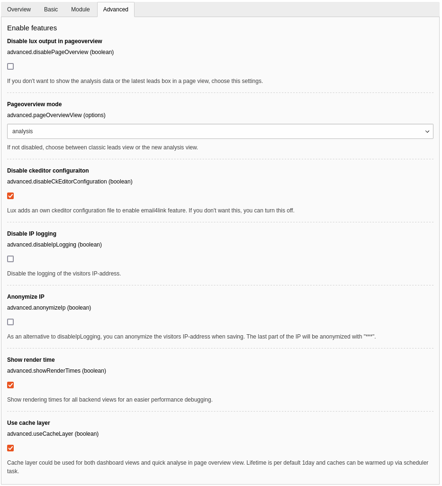

## IP addresses

LUX recognizes visitor IP addresses and can use it for a transformation to a geo-location and company by using an
IP service API.
In addition IP-addresses can be stored completely untouched or anynomized.
This small documentation shows you all configuration options related to IP-addresses in LUX.

### Extension manager configuration

* Disable IP logging: You can turn off the basic storage of any IP address in your database here
* Anonymize IP: Parts of the IP address are replaced with "***" before saving this value to your database



### IP address services

Via TypoScript you can configure if and which service interfaces are connected to convert a visitor IP address to a
location and a real company name (for b2b business).

Configure which service should be used:

```
lib.lux.settings {
  # Layer to use own ip information service (convert IP address to location and company)
  # More then one service can be registered. The first that deliver a result, will be used.
  ipinformation {
    # Main switch for using external IP services
    _enable = 1

    # ipapi.is
    # Useful database with many company information with 1,000 free requests per day (used by Salesflare, Mailmeteor, etc...)
    # Check website for gdpr information
    1 {
      class = In2code\Lux\Domain\Factory\Ipinformation\IpApiIs
      configuration {
        url = https://api.ipapi.is/?q={ip}
      }
    }

    # ipapi.co
    # Up to 30,000 free lookups per month without registration (used by Amazon, IBM, Oracle, etc...)
    # Check website for gdpr information
    2 {
      class = In2code\Lux\Domain\Factory\Ipinformation\IpApiCo
      configuration {
        url = https://ipapi.co/{ip}/json/
      }
    }

    # ipapi.com (from Vienna)
    # No free access without registration and only geo information
    # Check website for gdpr information
#    10 {
#      class = In2code\Lux\Domain\Factory\Ipinformation\IpApiCo
#      configuration {
#        url = https://api.ipapi.com/api/{ip}?access_key=YOUR_ACCESS_KEY
#      }
#    }
  }
}
```

Disabling in general can be done via:

```
lib.lux.settings.ipinformation._enable = 0
```

Disabling Ip-API.com but keep ipapi.is could be done via:

```
lib.lux.settings.ipinformation.1 >
```

**Note:** Take care that your lib.lux configuration is recognized by LUX (see FAQ section how to copy it to plugin.tx_lux_fe)
