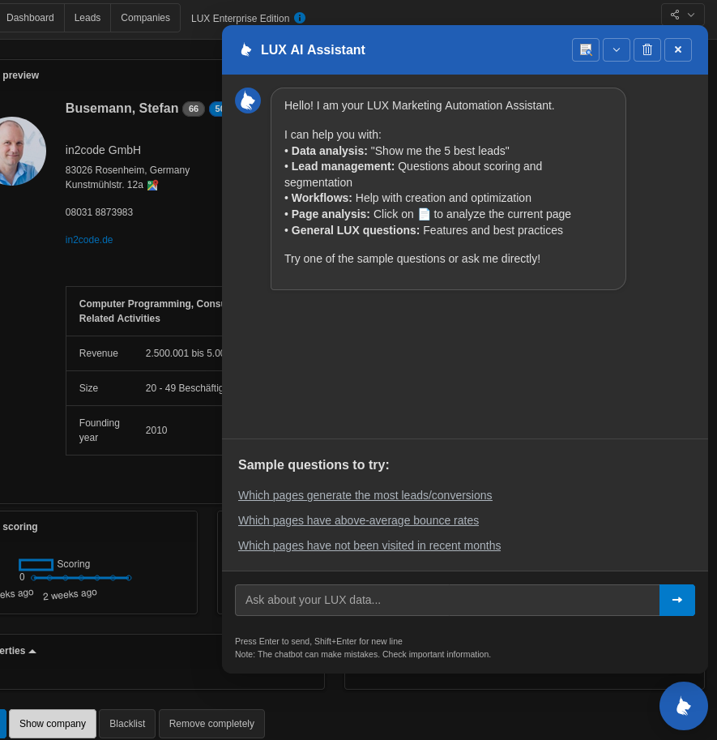
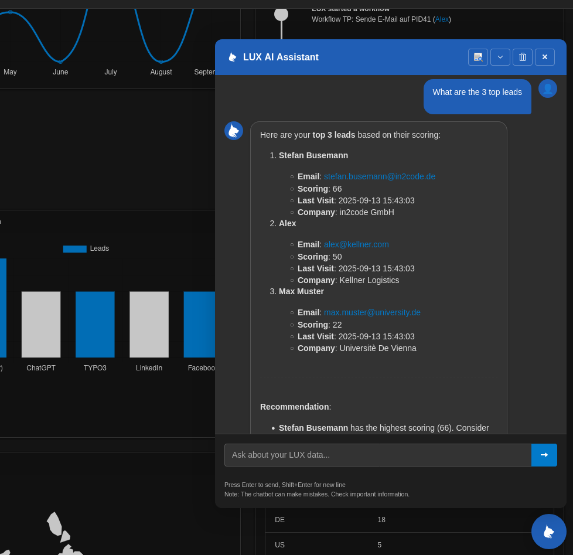
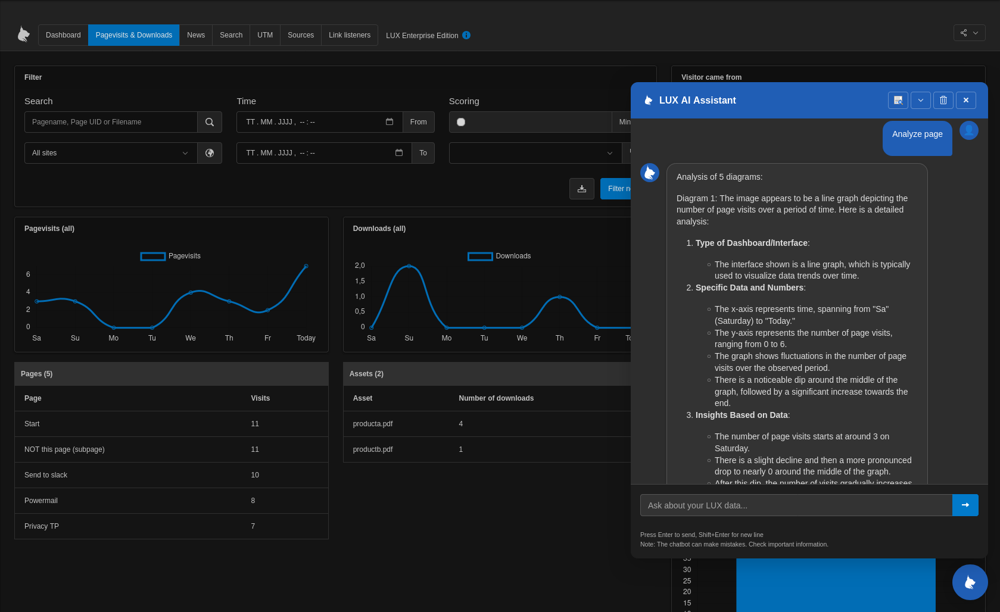

# AI integration into LUX (with LUXenterprise)

**NOTE:** This chatbot is only part of the enterprise version

Since LUXenterprise 46.0.0 we introduced an AI chatbot that helps you to create marketing campaigns and to improve
page content in your TYPO3

We currently use the latest Mistral LLM. Mistral is located in France (EU) to meet all GDPR requirements.

## Configuration

First of all, you should get a Mistral API key. To get one, please visit `https://mistral.ai/` and follow the process
by clicking on "Try the API".

Once you have an API key, you could use an ENV variable `MISTRAL_API_KEY`.

Suggested ENV variable in a .env file:
```
MISTRAL_API_KEY=ExampleKey49tqy0Hs2qCs3xIl4js0y
```

Alternatively, the extension configuration can be used to store an API key, if you don't want to use an ENV variable.

## First steps

The chatbot is visible in all LUX backend modules at the right bottom. By clicking on the LUX-Symbol the chat window
will be visible.
Now you can use it as you would use any chatbot like chatGPT. Try a first conversion by starting with a "Hello". If
everything works as expected, the LLM should give you an answer.



## Example questions

Because our prompt configures the LLM to a Marketing Automation expert with LUX, you can ask any marketing related
questions like "_How can marketing automation help to collect leads on my website?_"

Default prompt:

```
You are an expert in marketing automation and the TYPO3 LUX extension.
You help users analyze their lead data and provide practical advice on marketing automation.
If you need data, use the available tools.
```

Beside generally questions, you can also ask some LUX data related questions like:

* "_What are the 3 top leads?_"
* "_Show me the 5 best visited pages_"
* "_Show me 3 new leads_"
* "_Fetch a list of pages without traffic of the last 3 months_"
* "_Get pages with bounces_"
* "_Who is currently online?_"



## Interaction buttons and screenshot feature

### Interaction buttons

At the header there are 4 interaction buttons

* Screenshot feature (see below)
* Collapse window
* Clear history
* Close window


### Screenshot feature

The functions and data from LUX can quickly overwhelm and overwhelm an editor.
This is where the chatbot's screenshot feature comes in. Clicking the first icon in the header bar creates a
screenshot of the currently visible browser content and sends it to the LLM.
The LLM then analyzes the data, explains it, and provides examples of how to tailor website content to target
audiences, as well as other helpful marketing tips and tricks.



## FAQ

### Error: No connection to LLM (please check, if API-Key is defined and your network connection)

Please check if you defined a Mistral API key. If this don't help, check if the server can establish a connection to
URL `api.mistral.ai`. If not, maybe the firewall must be adjusted.

### What is a tool?

Tools are very helpful to offer data of your LUX database to the LLM. There are already some tools that enable data
related questions like "How many leads are in the system?"

## Upcoming features

* Following context: At the moment you cannot use the last question/answer for your next question.
* Adjustable prompts: We want you to be able to extend the default prompt with individual site information.
* Adjustable tools: Tools should be extended easily with own questions
* Showing diagrams: We want that the chatbot is even more helpful by showing you helpful graphics.
