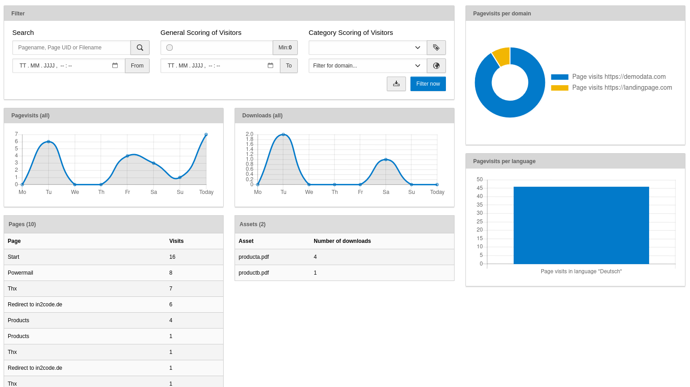
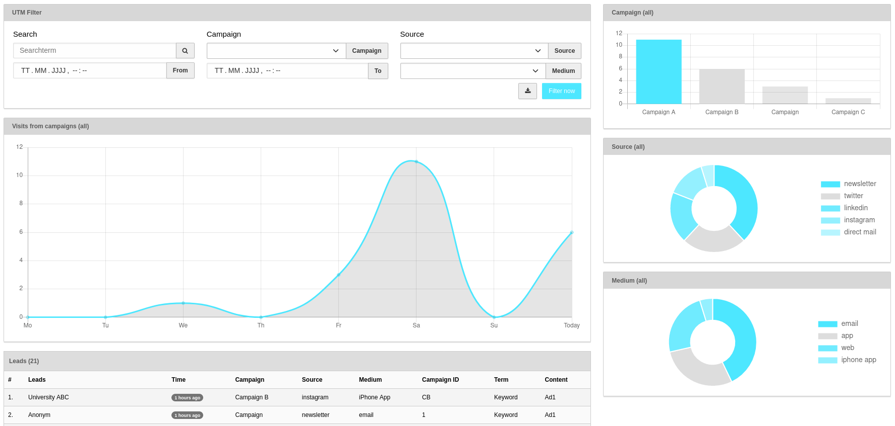
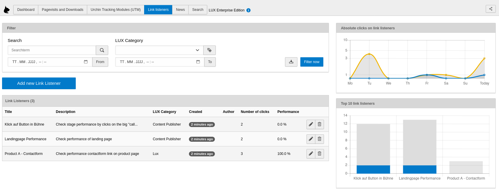
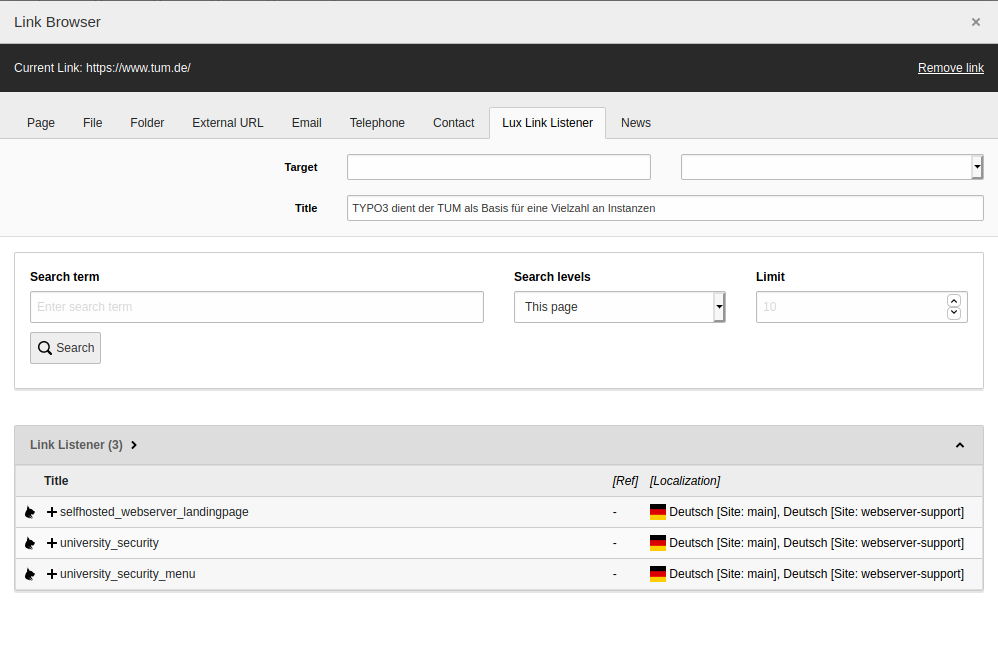
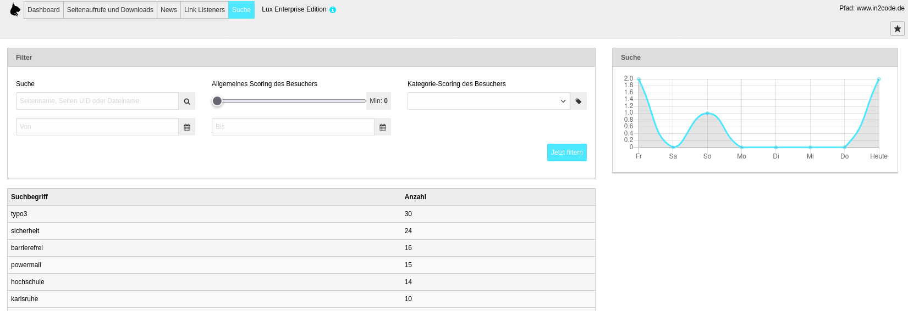

### Tracking and Analysis

This part of the documentation describes all configuration parts related to analysis and tracking of visitors and will
be automaticly loaded if you choose the main LUX static template in the root template.

#### TypoScript Configuration

The file [01_TrackingConfiguration.typoscript](../../../Configuration/TypoScript/Lux/01_TrackingConfiguration.typoscript)
contains all relevant settings for the visitor tracking.

LUX basicly tracks every vistors page request with the current time. In addition, it's possible to also track asset
downloads.

See the inline comments for a description in TypoScript:

```
lib.lux.settings {

    # All tracking settings
    tracking {
        pagevisits {
            # Toggle pagevisit tracking (on/off).
            # Switching this feature on will flood table tx_lux_domain_model_pagevisit but allow you to see a full pagefunnel of all of your visitors. Your decision :)
            _enable = {$plugin.tx_lux.settings.tracking.page}

            # Try to find a fe_user record when an email is given in visitor and build a relation to it
            autoconnectToFeUsers = 1
        }
        assetDownloads {
            # Toogle asset download tracking (on/off)
            _enable = {$plugin.tx_lux.settings.tracking.assetDownloads}

            # Allow only files with this extensions
            allowedFileExtensions = {$plugin.tx_lux.settings.tracking.assetDownloads.allowedExtensions}
        }
        search {
            # Toggle tracking of searchterms (on/off)
            _enable = {$plugin.tx_lux.settings.tracking.search}

            # Define where the searchterm is given (e.g. "tx_solr[q]")
            getParameters = tx_solr[q],tx_indexedsearch[sword]
        }
    }
}
```

**Note:** Take care that your lib.lux configuration is recognized by LUX
(see FAQ section how to copy it to plugin.tx_lux_fe)

Constants to this TypoScript part:
```
plugin.tx_lux.settings {
    # cat=lux//0010; type=boolean; label= Activate page tracking: (De)Activate tracking of the users pagefunnel.
    tracking.page = 1

    # cat=lux//0020; type=boolean; label= Activate download tracking: (De)Activate tracking if the user downloads an asset.
    tracking.assetDownloads = 1

    # cat=lux//0020; type=text; label= Activate download tracking: (De)Activate tracking if the user downloads an asset.
    tracking.assetDownloads.allowedExtensions = pdf,txt,doc,docx,xls,xlsx,ppt,pptx,jpg,png,zip

    # cat=lux//0050; type=boolean; label= Activate searchterm tracking: (De)Activate tracking searchterms if user searched for someone on your website.
    tracking.search = 1
}
```

Example page tracking request in browser console:


### Backend Module Analysis

#### Dashboard

Now, if LUX is up and running, you should see information in the Analysis Backend Module in the dashboard view:


The dashboard view should give you a quick overview about the latest activities and some useful information:
* How many recurring/unique leads
* The latest page visits
* The latest activities
* Identified leads vs. unknown leads
* Identifaction rate of the latest months
* Hottest leads (orderings by scoring)
* A world map for a basic visitor analysis
* A basic statistics about the records that are stored in LUX

Clicking on a name/email/"anonymous" will open a detail page with some more information of the lead.

**Note:** You can filter the dashboard view to leads from this or from previous month or from this year with the filter
select at the top

With a bit of TypoScript configuration it's possible to decide which activity status should be shown in activity log
in dashboard view:
```
lib.lux.settings {
    backendview {
        analysis {
            activity {
                # Greater then 0 means to also have "LUX identified a new lead", greater 1 means to not have this kind of messages
                statusGreaterThen = 1
            }
        }
    }
}
```

**Note:** Take care that your lib.lux configuration is recognized by LUX
(see FAQ section how to copy it to plugin.tx_lux_fe)

#### Pagevisits and Downloads

If you choose the content view (see top left to switch from dashboard to content), you will see the 100 most interesting
pages and assets for your leads.

Clicking on an asset or a page will open a detail page to this item, where you can exactly see which lead was interested
in this item.



**Technical note:** Page visits will be automatically be tracked with LUX on normal TYPO3 pages. In some rare scenarios
you may want to push a virtual pagevisit to LUX. This can be helpful if you want to track accordion opens, multistep
forms or other content changes without page reload and without a different URL. You can push such a visit via JavaScript:

```
const lux = LuxSingleton.getInstance();
lux.push('applicationProcess/step1', 'virtualPageRequest');
```

#### News

If you have installed the great news extension (georgringer/news), then you can also choose this view.
You will see the 100 most interesting news to your leads.

Clicking on a news will open a detail page to this item, where you can exactly see which lead was interested
in this item.

#### Urchin Tracking Modules (UTM)

With the help of UTM parameters, you can track the performance of your online marketing campaigns. As soon as there is
any tracking parameter available, LUX will save those parameters to a lead.

In addition to UTM parameters, you can now also use MTM parameters (compatible to Matomo) if this fits your needs more.
Available parameters:

| Title       | UTM key          | MTM key          | Description                                                                                |
|-------------|------------------|:-----------------|--------------------------------------------------------------------------------------------|
| Campaign    | `&utm_campaign=` | `&mtm_campaign=` | Name of your campaign                                                                      |
| Campaign ID | `&utm_id=`       | `&mtm_cid=`      | ID of your campaign (similar to utm_campaign - e.g. "campaign2023a")                       |
| Source      | `&utm_source=`   | `&mtm_source=`   | Source of this visit (e.g. "email", "google", "facebook", "linkedin", etc...)              |
| Medium      | `&utm_medium=`   | `&mtm_medium=`   | The medium that led to the visit (e.g. "mail", "browser", "iphone app", "qr code", etc...) |
| Term        | `&utm_term=`     | `&mtm_kwd=`      | Optional: e.g. a search term for google ads                                                |
| Content     | `&utm_content=`  | `&mtm_content=`  | Optional: e.g. the name of the google ad that was delivered                                |

If there are parameters saved in your LUX, you can analyse the leads to them in this module. All diagrams are
reacting to your filter settings. Of course, you can also use the CSV download if you want to.

Clicking on a lead will open a detail page to this lead.




#### Link Listeners

Link Listeners are introduced with LUX 9 and give you more power over your "call to action" performance on your
website.

The view starts with a list of Link Listeners and the possibility to manage them (add new, edit existing or delete old
Link Listeners). A Link Listener contains a title, a category (to increase category scoring - value can be defined in
the extension configuration and a link target.).

You can use the filter on the top for a perfect analysis in a timeframe or for a special Link Listener. If you click on
a Link Listener in the table you will see the latest leads in a preview. If you click on "Show details" then, you will
see all leads that used the defined Link Listener.



##### How to change a link to a Link Listener Link?

That's very simple. Just add a new Link listener with a link target. After that, go to your RTE and set a link to your
new Listener. That's all. Now all clicks on this link are tracked now.




#### Search

Searchterms can be tracked to improve search evaluation on your website.

If there are entries in the search table, editors can see and click the search view button in analysis backend module.
The view starts with a list of used searchterms of your websearch.

You can use the filter on the top for a perfect analysis in a timeframe or for a special term. If you click on
a row in the table you will see the latest leads in a preview. If you click on "Show details" then, you will
see all leads that used the search term.



To **track searchterms**, there are basically two different ways:

1) Ensure, that there is a GET parameter in the current URL, that can be recognized by LUX.
Parameters for solr, indexed_search and ke_search are automatically configured. If you need an individual
parameter, you have to extend the TypoScript configuration. So e.g. a URL like
`https://website.com/?q=searchterm` or `https://website.com/?tx_solr[q]=searchterm` will automatically be tracked here.

2) If you don't have the searchterm as GET parameter available in the URL, you can push a searchterm
via JavaScript manually to LUX. This can be e.g. helpful if your search results are only loaded via AJAX.
See this example how to push a searchterm via JS:
```
const lux = LuxSingleton.getInstance();
lux.push('any searchterm', 'searchRequest');
```


### TYPO3 Dashboard Module

In addition to the build in dashboard, since TYPO3 10 it is possible to install another dashboard for system-wide
diagrams in TYPO3.
You could do this simply with `composer require typo3/cms-dashboard`. Once it is available, you can add some widgets
from LUX.

This is a screenshot from default values:


Available widgets:

| Title               | Type             | Size   | Description                          |
|---------------------|------------------|--------|--------------------------------------|
| Page visits         | `bar chart`      | medium | Top page visits of the current year  |
| Downloads           | `bar chart`      | medium | Top downloads of the current year    |
| News vists          | `bar chart`      | medium | Top news visits of the current year  |
| Searchterms         | `bar chart`      | medium | Top search terms of the current year |
| Identified          | `bar chart`      | small  | Identified vs. anonymous leads       |
| Identified by month | `bar chart`      | medium | Identified leads grouped by month    |
| Recurring visitors  | `doughnut chart` | small  | Recurring vs. unique visitors        |
| Page visits week    | `bar chart`      | medium | Page visits of the current week      |
| Downloads week      | `bar chart`      | medium | Downloads of the current week        |
| Referrers           | `bar chart`      | medium | Show external referrer domains       |
| Browsers            | `doughnut chart` | small  | Show visitor browsers                |
| Hottest leads       | `list view`      | small  | Show hottest visitors                |
| UTM campaign        | `bar view`       | medium | Show best UTM campaigns              |
| UTM sources         | `doughnut chart` | small  | Show best UTM sources                |
| UTM media           | `doughnut chart` | small  | Show best UTM media                  |
