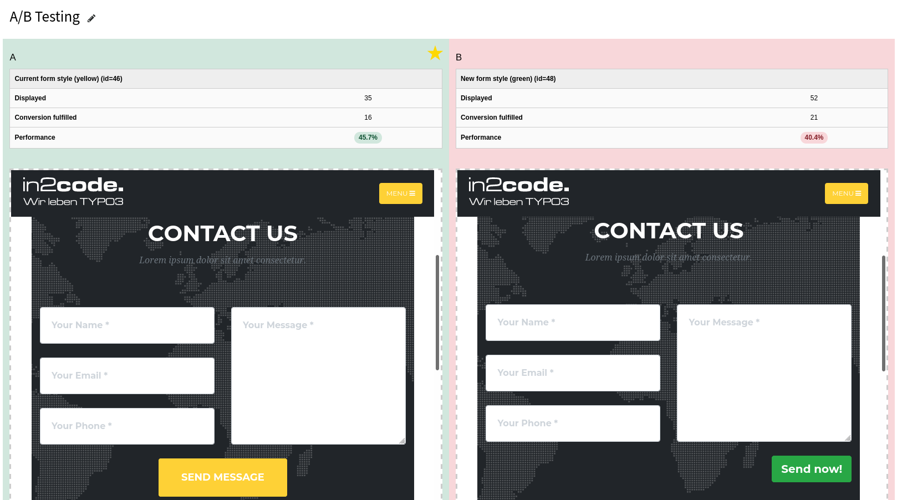

#### A/B testing

This part of the manual describes how to use A/B testing in TYPO3.

##### Functionality

This feature is based on page-wide A/B testing. This means that you have to add additional pages to a current existing
page and configure that page A or B (the new one) should be delivered randomly.

So first of all choose a page that you want to test (this is A). Copy this page, hide it in Navigation and
change only a few things on this page (this is B).

**Tipp:** For a meaningful test result you should consider not to change too much elements between two pages.
If you want to learn if a green or a blue button is clicked more often, don't change anything else then the color of
this specific button.

##### Configuration

If you open page settings in page A for editing properties as an editor, you will see a new tab called "Marketing".
In this tab you can check *A/B testing enabled for this page* to enable A/B tests.

After that you will see some more fields. Add a title, a description and two page records. Page record 1 with title A
and select the current page, that you are editing. Add a title to page record 2 and also select page B.
Read for your first test.

| Field                                            | Description                                                                                               |
| ------------------------------------------------ | --------------------------------------------------------------------------------------------------------- |
| A/B testing enabled for this page                | A/B testing for this page is turned on in general                                                         |
| Title                                            | Name this test like "Button test"                                                                         |
| Description                                      | Add a description like "Test if button in blue is better then in green"                                   |
| Start                                            | Optional: Choose a date if this test should start in the future                                           |
| End                                              | Optional: Set an enddate if you want that this test stop automatically at a specific date                 |
| Conversion method                                | Select which visitor action leads to a conversion (Click on defined HTML element will open another field) |
| Select a (or more) HTML element(s) on the page   | Select one ore more HTML elements like `.class` or `#id` or `[data-foo="bar"]`                            |
| Add some pages to test                           | You need to add 2 up to 12 pages records here                                                             |
| Page/Title                                       | Add a name for this page - like "Page A"                                                                  |
| Page/Page                                        | Select a page from the pagetree                                                                           |
| Page/Configure frequency                         | Check this if you want to make some more configuration (will show more fields)                            |
| Page/Incidence of this testing page              | If all testing pages are set to 100, all are delivered with the same probability (as long as starttime and endtime doesn't exclude the rendering). You can reduce the probability of single pages if you don't want to deliver them that ofen |
| Page/Starttime (optional)                        | If this page should be shown in future only, select a date                                                |
| Page/Endtime (optional)                          | If delivering this page should be stopped automatically at a specific date, select a date                 |

##### Results

Once you have activated A/B tests in page properties, you will see a result in pageoverview:

##### Backend module

In the backend module you will see all active A/B tests with a short overview about their performance.
Buttons allows you to change to edit view of a page or to pageoverview module with that page.
