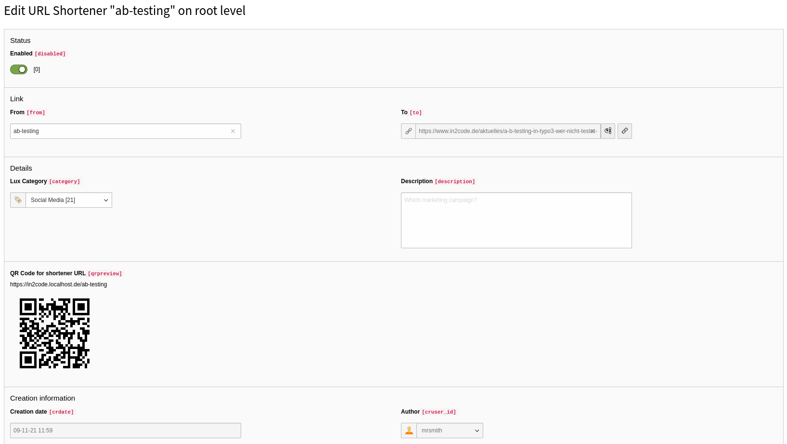

#### URL shorteners

This part of the manual describes how to manage URL shortener with lux.

URL shorteners help you to build individual short URL on your domain for your marketing campaigns. You can track visits
of short URL usage per lead.

##### List view

If you open the backend module campaigns you can switch to "URL shortener" by clicking the button on the top.
A list view is shown.

This view works basicly like every other view in Lux. You can filter your shorteners per searchterm, category or per
timeframe. Diagrams are showing you "overall usage", "top shortener" and visits from "socialmedia".

A click on an existing shortener will show you individual information about the leads that used this shortener.

##### Detail view

If you click on the edit icon symbol, the edit view is opened. This view is similar to the view if you add a new
shortener record.

| Field         | Description                                                                          |
|---------------|--------------------------------------------------------------------------------------|
| Enabled       | Toggle the status of this redirect.                                                  |
| From          | Contains your short url (without a domain). This code must be unique in your system. |
| To            | Select the internal or external target for the redirect                              |
| Lux category  | Choose a category for better management of your shorteners                           |
| Description   | You can add an internal description for what campaign this shortener is              |
| QR code       | If you need a QR code for your marketing campaign, you can download this PNG         |
| Creation date | Note when was this record created                                                    |
| Author        | Note to see who was creating this record                                             |

