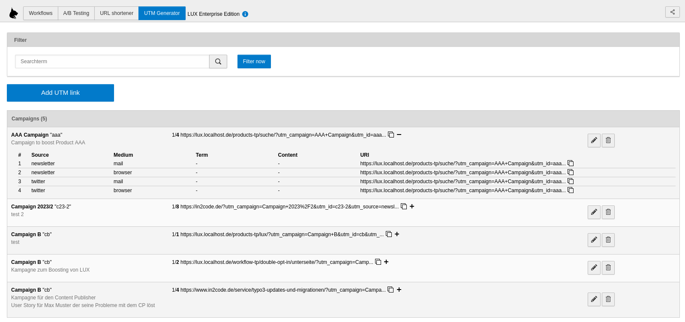
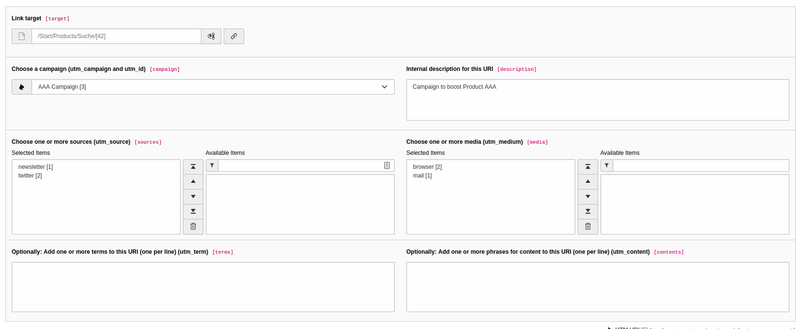

#### UTM generator

UTM stands for Urchin Tracking Modules and is helpful to measure the performance of your online campaigns. This can
be done with "UTM" GET parameters that are added to a target URL.

General used UTM parameters in marketing automation and analysis:

| Parameter      | Description                               | Example value     |
|----------------|-------------------------------------------|-------------------|
| `utm_campaign` | Name of the campaign                      | `Campaign 2023/2` |
| `utm_id`       | Identifier of the campaign                | `c23-3`           |
| `utm_source`   | Source                                    | `newsletter`      |
| `utm_medium`   | Technical medium                          | `mail`            |
| `utm_term`     | Optional: Searchterm (mostly used in ads) | `productname`     |
| `utm_content`  | Optional: Description of the ad           | `add1`            |

**Note:** LUX tracks all of those GET parameters automatically and can be analysed in Analyse backend module. This
means that you don't have to use the build in UTM generator or to add all possible options to your system.
Tracking starts as soon as ANY UTM parameter is given to a page request.

So, if you want to boost a landing page or a product page, you have to create a lot of URIs with those parameters. We
want to make marketeers life easier by creating an URI UTM generator tool, that can be used to create URIs for your
campaigns.

##### List view

If you open the backend module campaigns you can switch to "UTM Generator" by clicking the button on the top.
Another list view is shown.

This view works basicly like every other list view in Lux. You can filter your URI records by adding a searchterm.
Every table row shows the campaign name and the first available URI. By clicking on the plus symbol, all available
URIS are shown.

##### Edit view

If you click on the edit icon symbol or if you add a new record, the edit view is opened.
This view is similar to the view if you add a new shortener record.

**Note:** You have to add records of type `Campaign (UTM)`, `Source (UTM)` and `Medium (UTM)` first with the list view
module of TYPO3 to any folder page. Those records can be then selected in the edit view.

| Field       | Description                                  |
|-------------|----------------------------------------------|
| Link target | Choose an internal page or external URL      |
| Campaign    | Choose an existing campaign record           |
| Description | Add an internal description                  |
| Sources     | Choose one or more existing source records   |
| Media       | Choose one or more existing medium records   |
| Terms       | Add one or more terms (one per line)         |
| Contents    | Add one or more content terms (one per line) |

