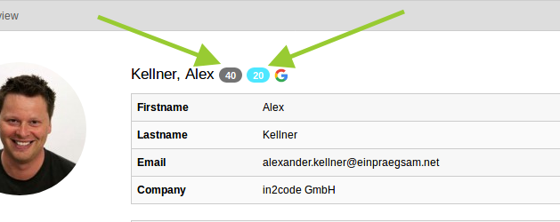
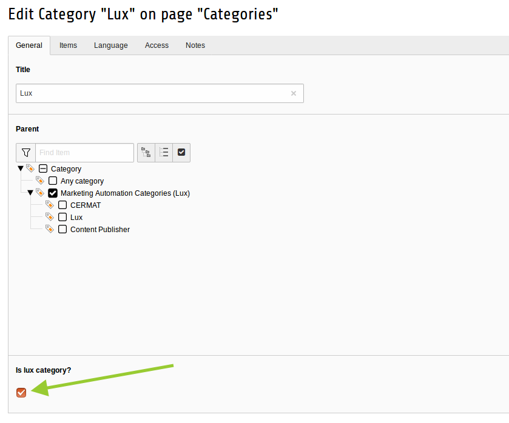
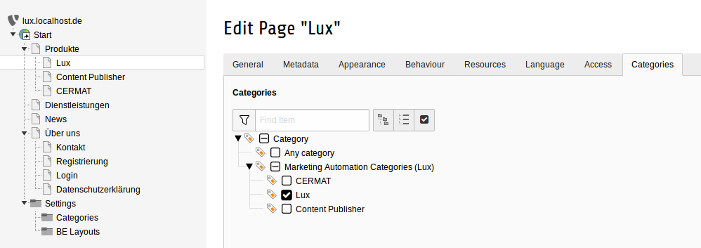
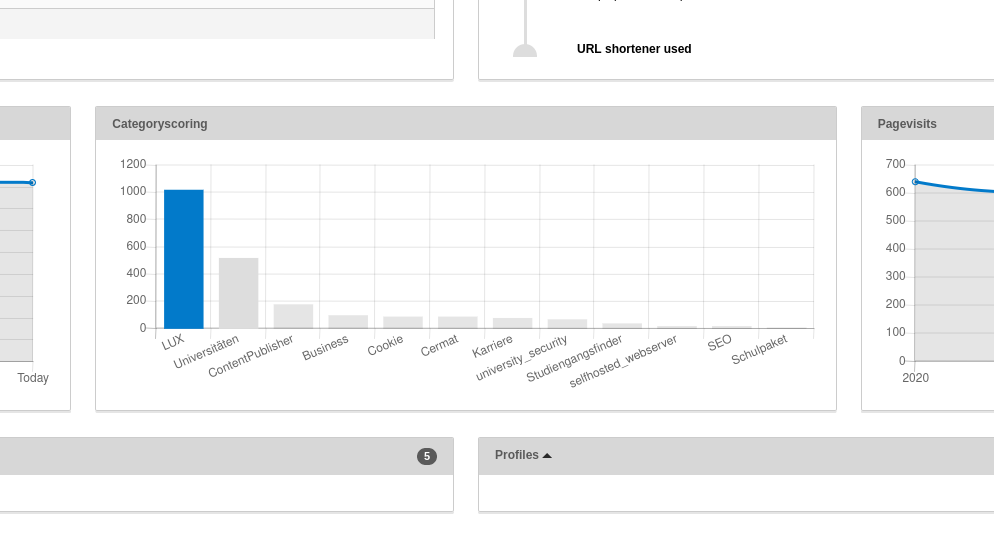

### Scoring and Categoryscoring

This part of the documentation tells us a bit about scoring and categoryscoring and how to configure lux for that.

While scoring reflects **how hot a lead is** in general, category scoring shows which product/service
is the right choice for different leads (see glossary at [Marketing Information](../../Marketing/Index.md)).


#### Scoring

A basic scoring tells us how interested a lead is in general. So page visits and downloads are the key.

The default scoring calculation is stored in the Extension Manager settings of lux (see part
[Installation](../Installation/Index.md)) and is:

```
(10 * numberOfSiteVisits) + (1 * numberOfPageVisits) + (20 * downloads) - (1 * lastVisitDaysAgo)
```

**Note:** If you're using *lastVisitDaysAgo* you want to decrease scoring if the last page visit of the lead was a while
ago. That means that you have to call a CommandController once a day (or night) for a calculation.

The general scoring is visible on different views in Lux. Mostly beside the lead identification.
The value in the grey badge reflects the general scoring. The value in the blue badge reflects the hottest category
scoring:



#### Categoryscoring

You know your business much better than us. So you have to think about, which categories reflect which part of your
business in your TYPO3 installation.
In our case, we could use a category for this product **lux** another for our product **Content Publisher**
and probably a third for **carreer** to find new collegues who wants to help us with lux and TYPO3.
Of course a download or a page visit of an asset/page of a lux category should increase a category scoring.

What can we do with the knowledge about leads and their category scoring? Lux is able to execute workflow actions
(see [Workflow](../Campaigns/Index.md)) based on category scoring or show contextual content
(also based on category scoring - see [Plugins](../Plugins/Index.md)).

##### Configuration

You can simply define some lux-categories in your TYPO3. A lux-category is just a sys_category record in TYPO3.
Don't forget to check the checkbox "lux-category".



After you added some lux-categories to your system, you can mark pages and files with that categories.


##### Calculation

Per default every visit of a page of a lux-category will increase category-scoring with **factor 10** while a download
will increase the value by **20** (a download is a larger action then a simple pagevisit - this results in more scoring
points of course).

If you want to change the factors, you can do this in the Extension Manager in the settings of lux (see part
[Installation](../Installation/Index.md)).

##### Analysis

Just open a lead detail-view. You will see all relevant information about category scorings to this lead.


