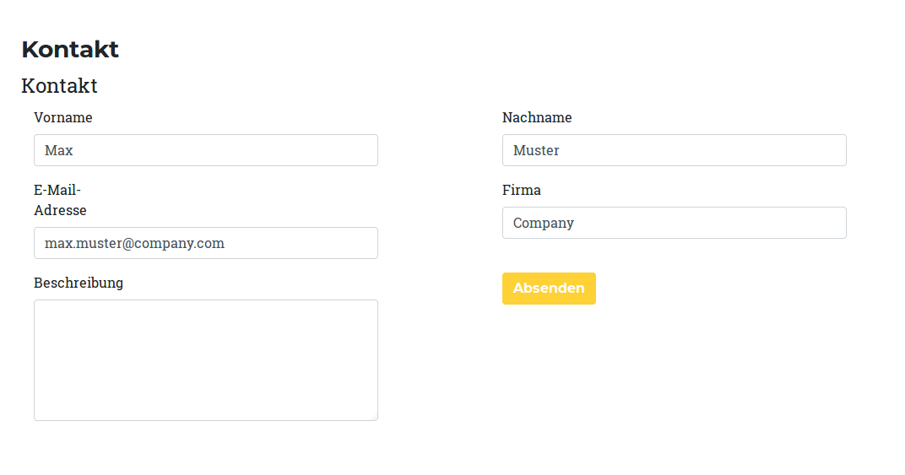
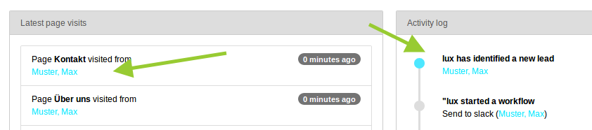

### Identification

This part of the documentation describes different possibilities to **identify your leads**.
Identification means that you are able to know the person behind the lead.
And this needs an unique identification-property from the lead.
E.g. firstname would be - of course - not a good property because this is not unique.
Marketing Automation tools are going to use the **email-address** as unique property of the user.
And... emails are great because, you can:

* identify the lead
* see the firstname as part of the email address (mostly given in business cases)
* see the lastname as part of the email address (mostly given in business cases)
* see the company as part of the email address (mostly given in business cases)
* having an url (company) where you can simply find more interesting stuff of your lead
* send marketing relevant information in newsletters

So, if email-addresses are great and we want to collect the email from our unknown leads - how can we do this? The
answer is simple: We have to deal a bit with our visitors. Let them download an interesting asset (e.g. a whitepaper)
but ask for their email address first. Another way would be to offer a callback-form where you offer to call the
visitor - also ask for the email address here. Is there a form, where the visitor can get access to a software?
You guessed it, ask for the email address.

Going back to the technical part - forms will help us on lead identification.

#### Field mapping

The easiest way for an identification is to offer some forms on your website where you listen to the values that your
visitors add there. Lux will help you to listen on any webform (no matter if it is powermail, femanager, form,
formhandler, felogin or a static html content). The technique behind is simple. You can map field names to lead
properties via TypoScript.

The default mapping will e.g. map a field with name `tx_powermail_pi1[field][e-mail]` to the lead property *email*
(see TypoScript below).

```
lib.lux.settings {

    # All identification settings
    identification {
        # En- or Disable field identification
        _enable = {$plugin.tx_lux.settings.fieldidentification}

        # Auto identify with EVERY input field of your website.
        # Using a * as wildcard will search for a string in a string while using a key without * will search for the exact match.
        fieldMapping {
            # "email" is the key-field for visitor identification and merging.
            email {
                0 = *[email]
                1 = *[e-mail]
                2 = *[e_mail]
            }
            firstname {
                0 = *[firstname]
                1 = *[first-name]
                2 = *[first_name]
                3 = *[firstName]
                4 = *[vorname]
            }
            lastname {
                0 = *[lastname]
                1 = *[last-name]
                2 = *[last_name]
                3 = *[lastName]
                4 = *[surname]
                5 = *[sur-name]
                6 = *[sur_name]
                7 = *[name]
                8 = *[nachname]
            }
            company {
                0 = *[company]
                1 = *[firma]
            }
            phone {
                0 = *[phone]
                1 = *[telefon]
                2 = *[tel]
            }
            username {
                0 = username
                1 = user
                2 = benutzername
                3 = benutze
            }
        }
    }
}

```

You can test the field mapping by adding a simple form to your frontend. Open a second browser and fill out the form.
As soon as you enter an email and leave the field (on blur), the values are sent asynchronical to Lux. You don't have to
submit the form. Just go into the backend and check if the lead gets identified.

Example powermail form in frontend:


Example lead identification in dashboard:



#### Email4link

There is another build in feature, where you can simply ask for email addresses if a lead wants to download something.
A plugin for the CKEditor helps you to change every link into a lux email4link-link.

Example configuration yaml file for your CK Editor with lux email4link:

```
imports:
    - { resource: "EXT:rte_ckeditor/Configuration/RTE/Processing.yaml" }
    - { resource: "EXT:rte_ckeditor/Configuration/RTE/Editor/Base.yaml" }
    - { resource: "EXT:rte_ckeditor/Configuration/RTE/Editor/Plugins.yaml" }

editor:
  externalPlugins:
    luxEmail4Link:
      resource: 'EXT:lux/Resources/Public/JavaScript/Static/CkEditorPlugins/luxEmail4Link/plugin.js'

  config:

    allowedContent: true
    contentsCss: ['EXT:lux/Resources/Public/Css/Modules.min.css']

    toolbarGroups:
      - { name: 'styles', groups: [ 'styles' ] }
      - { name: 'basicstyles', groups: [ 'basicstyles', 'cleanup' ] }
      - { name: 'paragraph', groups: [ 'list', 'indent', 'blocks', 'align', 'bidi', 'paragraph' ] }
      - { name: 'links', groups: [ 'links', 'Email4Link' ] }
...
```

See the related default TypoScript configuration:
```
lib.lux.settings {

    # All identification settings
    identification {

        # Email4Link configuration if visitor wants to receive a mail
        email4link {
            mail {
                # Enable/Disable
                _enable = 1

                # Template file for mail with asset attachment
                mailTemplate = EXT:lux/Resources/Private/Templates/Mail/Email4LinkMail.html

                # Mail subject
                subject = Your requested asset

                # From name for mail to visitor
                fromName = Website

                # From email for mail to visitor
                fromEmail = marketing@website.org

                # Allow only files with this extensions
                allowedFileExtensions = pdf,txt,doc,docx,xls,xlsx,ppt,pptx,jpg,png,zip

                # Allow only sending of files within this storages (commaseparated uid list)
                allowedStorages = 1
            }
        }
    }
}
```

After that, you can change every link in the CK editor:


| Field                     | Description                                                                                            |
| ------------------------- | ------------------------------------------------------------------------------------------------------ |
| Title                     | Show a title in the lightbox that opens on click in frontend                                           |
| Description               | Show a description in the lightbox that opens on click in frontend (optional)                          |
| Send asset via email      | Try to send asset as attachment via email (only possible for allowed file extensions - see TypoScript) |

All clicks in frontend will be catched now by JavaScript and opens a lightbox:


**Note:** If you want to also use the email4link feature in your HTML-Templates, you can simply add some data-attributes
to your links.

```
<a
    class="btn btn-primary"
    href="/fileadmin/whitepaper.pdf"
    data-lux-email4link-sendemail="true"
    data-lux-email4link-text="Please give us your email-address, we're going to send you the asset."
    data-lux-email4link-title="Receive document via email.">Download our whitepaper</a>
```
