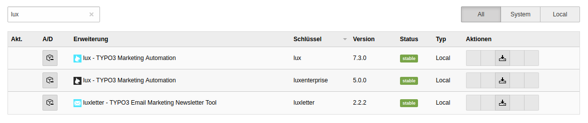
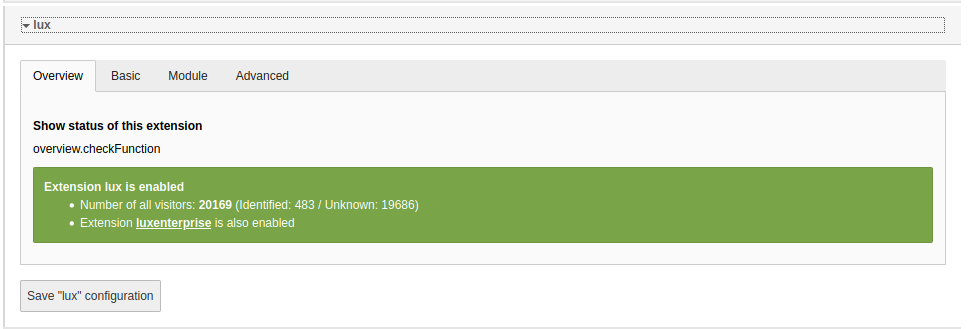
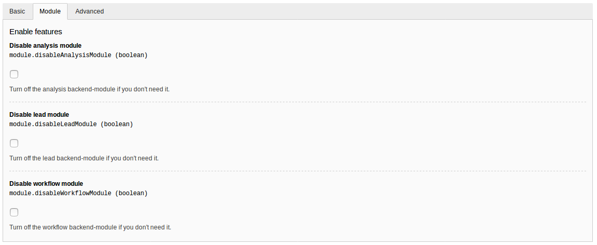
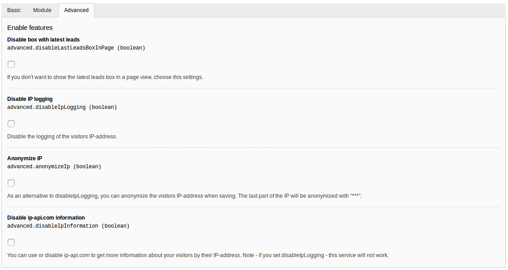
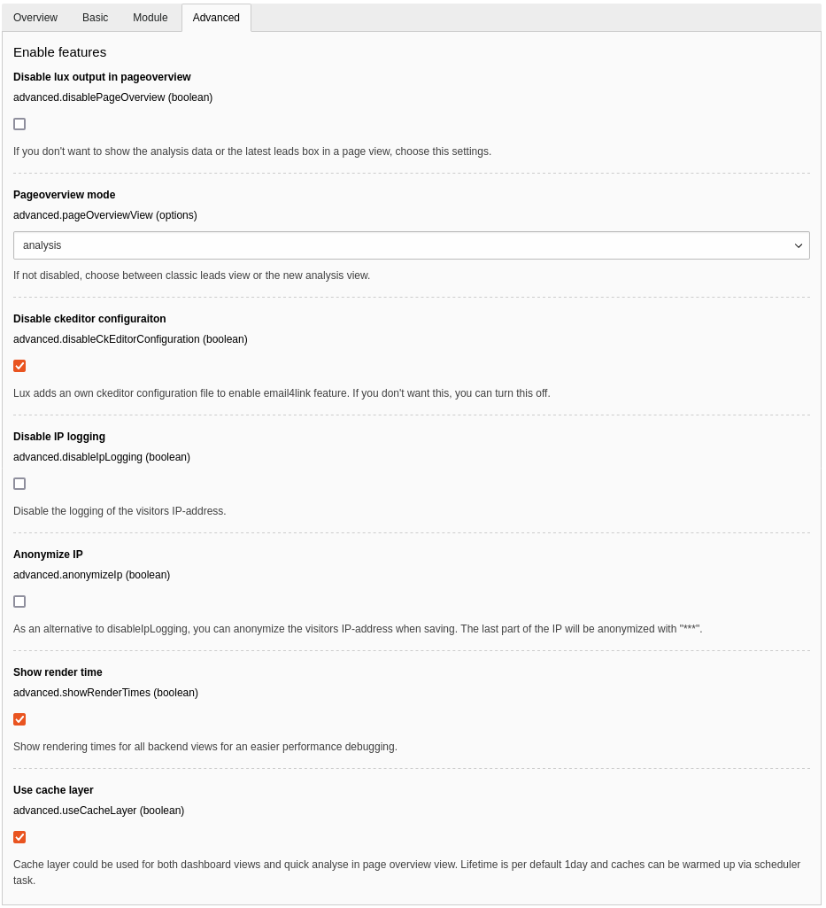
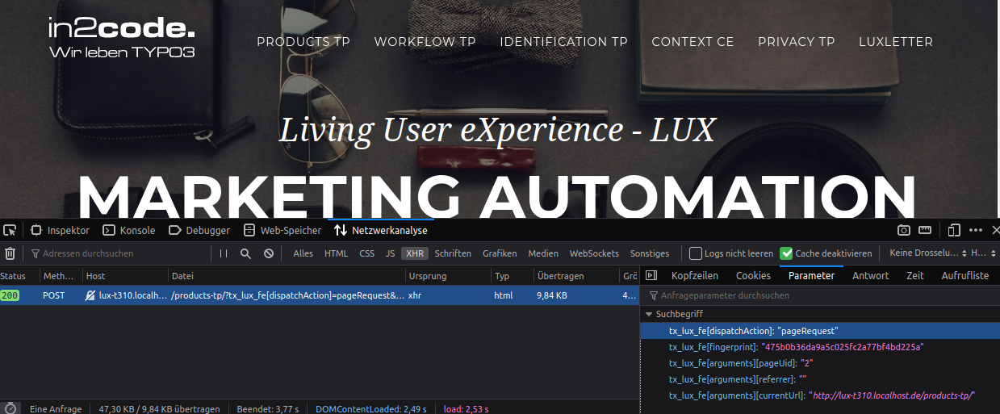

### Installation

This part of the documentation describes how to install lux to your TYPO3 instance.

#### 1. Requirements (of the latest version)

* TYPO3 12 or 13
* PHP 8.1 or higher
* TYPO3 must run in **composer mode**

#### 2. Installation via composer

Example composer.json file:

```
{
  "require": {
    "php": "^8.1",
    "typo3/cms": "^13.4",
    "in2code/lux": "^38.0",
  }
}
```

Because lux is registered at packagist.org, you can simply do a `composer req in2code/lux` for example to
install the package. Don't forget to activate (e.g. in the extension manager) the extension once it is installed.

**Note:** You need access to our private packagist for an installation of EXT:luxenterprise

**Note:** Lux itself will also load some other php packages:
* symfony/expression-language for a calculating magic
* whichbrowser/parser to show some information about the user agent
* in2code/google-image-grabber to show an image by email address from google images

#### Extension Manager settings



If you click on the settings symbol for extension lux, you can change some basic settings in lux extension.






| Setting                                       | Description                                                                                                                                                                                                                                                                                                 |
|-----------------------------------------------|-------------------------------------------------------------------------------------------------------------------------------------------------------------------------------------------------------------------------------------------------------------------------------------------------------------|
| Overview: Extension status                    | Just a small overview over the extension.                                                                                                                                                                                                                                                                   |
| Basic: Scoring Calculation                    | Define a calculation model for the basic lead scoring.<br>Available variables are - numberOfSiteVisits, numberOfPageVisits, downloads, lastVisitDaysAgo.<br>Note - you should run a commandController (e.g. every night) and calculate the scoring again, if you are using the variable "lastVisitDaysAgo". |
| Basic: Add on page visit                      | Categoryscoring: Add this value to the categoryscoring if a lead visits a page of a lux-category                                                                                                                                                                                                            |
| Basic: Add on news visit                      | Categoryscoring: Add this value to the categoryscoring if a lead visits a news page (tx_news)                                                                                                                                                                                                               |
| Basic: Add on download                        | Categoryscoring: Add this value to the categoryscoring if a lead downloads an asset of a lux-category                                                                                                                                                                                                       |
| Basic: Add on click on Link Listener          | Categoryscoring: Add this value to the categoryscoring if a lead clicks on a Link Listener link                                                                                                                                                                                                             |
| Basic: PID to save Link Listener records      | Define a PID where the link listener records should be stored (relevant for the editors user rights)                                                                                                                                                                                                        |
| Module: Disable analysis module               | Toggle the backend module Analysis in general                                                                                                                                                                                                                                                               |
| Module: Disable lead module                   | Toggle the backend module Leads in general                                                                                                                                                                                                                                                                  |
| Module: Disable workflow module               | Toggle the backend module Workflows in general                                                                                                                                                                                                                                                              |
| Advanced: Disable lux in page overview module | Toggle the lux analysis or leads box in page module in general                                                                                                                                                                                                                                              |
| Advanced: Pageoverview mode                   | If not disabled, choose between classic leads view or the new analysis view                                                                                                                                                                                                                                 |
| Advanced: Disable ckeditor configuration      | Toggle if an automatic ckeditor configuration should be added or not (for email4link feature)                                                                                                                                                                                                               |
| Advanced: Disable ip logging                  | Disable the logging of the visitors IP address                                                                                                                                                                                                                                                              |
| Advanced: Anonymize IP                        | As an alternative to disableIpLogging, you can anonymize the visitors IP-address when saving. The last part of the IP will be anonymized with "***"                                                                                                                                                         |
| Advanced: Lead picture                        | Decide if TYPO3 should try to find an image of a lead by searching on gravatar.com (with hashed email) or on bing image search by given email domain (not full address).                                                                                                                                    |
| Advanced: Show render time                    | For an easier debugging all views in backend can be shown with render times. This is only visible for backend administrators.                                                                                                                                                                               |
| Advanced: Use cache layer                     | If you are facing performance issues with lux backend modules or with the page overview view (quick analysis), you can cache views (e.g. for 24h) when turning the feature on. In addition there is a command that can be executed via scheduler task to warmup caches (e.g. every night).                  |

#### 3. Add TypoScript

If you have already activated lux in your TYPO3 instance, you can add the static TypoScript file *Main TypoScript (lux)*
in your root template. Most of the TypoScript configuration is used for frontend and for backend configuration.

##### 3a Constants

Look at the default settings of your lux in TypoScript constants.
At least the sender email address needs to be modified from you.

```
plugin.tx_lux.settings {
  # cat=lux//0010; type=boolean; label= Activate frontend functionality: All frontend functionalities can be toggled for testing or against flooding
  enableFrontendController = 1

  # cat=lux//0020; type=boolean; label= Activate autoenable: Decide if user tracking is turned on by default (no opt-in needed here). If you turn autoenable off, you have to build an opt-in.
  autoenable = 1

  # cat=lux//0030; type=options[0,2]; label= Identification method: Decide if fingerprinting (0) or local storage (2) method should be used for tracking your leads. Both methods have their ups and downs (see documentation for details).
  identificationMethod = 0

  email {
    # cat=lux//0100; type=text; label= Default sender name: Default sender name for mails
    defaultSenderName = Marketing

    # cat=lux//0110; type=text; label= Default sender email: Default sender email address for mails
    defaultSenderEmail = marketing@website.org
  }

  tracking {
    # cat=lux//0200; type=boolean; label= Activate page tracking: (De)Activate tracking of the users pagefunnel.
    page = 1

    # cat=lux//0210; type=boolean; label= Activate download tracking: (De)Activate tracking if the user downloads an asset.
    assetDownloads = 1

    # cat=lux//0220; type=text; label= Activate download tracking: (De)Activate tracking if the user downloads an asset.
    assetDownloads.allowedExtensions = pdf,txt,doc,docx,xls,xlsx,ppt,pptx,zip

    search {
      # cat=lux//0230; type=boolean; label= Activate searchterm tracking: (De)Activate tracking searchterms if user searched for someone on your website.
      enable = 1

      # cat=lux//0240; type=text; label= search GET parameters: Listen for searchterms in available GET parameters
      getParameters = q,tx_solr[q],tx_indexedsearch[sword],tx_indexedsearch_pi2[search][sword],tx_kesearch_pi1[sword]
    }

    company {
      # cat=lux//0300; type=boolean; label= Activate tracking via wiredminds: (De)Activate tracking enrichment of lead data via wiredminds.com
      enable = 0

      # cat=lux//0310; type=text; label= Wiredminds token: Add token from Wiredminds
      token =

      # cat=lux//0320; type=text; label= Wiredminds limit per month: Define a limit for requests per month (for best cost control)
      connectionLimit = 5000

      # cat=lux//0330; type=text; label= Wiredminds limit per hour: This limit is a safety function to prevent unwanted number of requests to interface (e.g. on a DoS attack)
      connectionLimitPerHour = 150

      autoConvert {
        # cat=lux//0340; type=boolean; label= Activate automatic tracking: (De)Activate tracking of new and unknown leads
        enable = 0

        # cat=lux//0350; type=int+; label= Scoring for automatic tracking: Start automatic tracking only of lead has a minimum scoring of this value
        minimumScoring = 0
      }
    }
  }

  # cat=lux//0400; type=boolean; label= Activate field and form identification: (De)Activate identification by filling out web forms.
  fieldandformidentification = 1

  # cat=lux//0400; type=boolean; label= Disable for identified: Disable email4link lightbox in frontend if the visitor is already identified.
  disableEmail4DownloadForIdentifiedVisitors = 1

  # cat=lux//0500; type=boolean; label= Disable for backend users: Disable lux tracking in frontend if you are also logged in into backend.
  disableTrackingForBackendUsers = 1

  # cat=lux//0600; type=int+; label= PID privacy page: Set the pid of the privacy page for links in lux forms.
  pidPrivacyPage = 11
}
```

**Note:** For a first testing, you may want to be logged in into backend and also track your page visits. This can be done
with this constants: `plugin.tx_lux.settings.disableTrackingForBackendUsers=0`

##### 3b Fingerprint or LocalStorage

With the constant `identificationMethod` (see above) you can decide if lux should work in fingerprint or in
localstorage mode. While a fingerprint can be calculated by hardware details automatically, a localstorage mode is
similar to a cookie. We would also don't use `autoenable` if you want to go for local storage and ask your visitors
for an opt-in.

###### Fingerprint (recommended for B2B)

**Upside:** Fingerprint is calculated automatically and does not need to be stored anywhere on the device
(cookie or local storage). A tracking between different domains and page branches is possible
within the same TYPO3 instance.

**Downside:** To calculate a fingerprint every page request needs 200-400ms on top (asynchronous).
Beside that multiple visitors with same hard- and software
are recognized as only one visitor, if they are using the same IP-address.
This is especially true for iPhones of the same version and generation.

###### LocalStorage (recommended for B2C)

**Upside:** If you have a lot of mobile visitors on your website (e.g. if you own a b2c shop for a younger target
group), you may want to differ between your visitors. So you could go for LocalStorage. This is comparable to a cookie.
A random string will be saved on the visitor's device, which can be done very quickly.
You can also differ between multiple mobile visitors - even with same hardware and IP-address.

**Downside:** You have to ask your visitor if you are allowed to store a random string the local storage of the device,
to identify your visitor. To meet GDPR rules, we would suggest you to set up a cookie banner.
In addition, a visitor of domain A is not automatically merged if he also visits domain B on the same TYPO3 instance
(every domain has its own local storage area. Of course if the user is identified on both domains, the profile will be
merged to only one).

#### TypoScript

If you want to see in detail what kind of TypoScript will be included and how to overwrite some parts, look at
[the Lux folder](../../../Configuration/TypoScript/Lux)

#### 4. Ready to go

lux is now up and running. If you go into the frontend of your webpage and open the browser console, you should see
an asynchronical request to every page request.



**Note:** Take care to be not logged in into your TYPO3-backend at the same time with the same browser
or turn on tracking for BE-Users via TypoScript.

**Note2:** Take care that your browser does not have activated the DoNotTrack (DNT)
setting (Default for FireFox Anonymous Tab)
