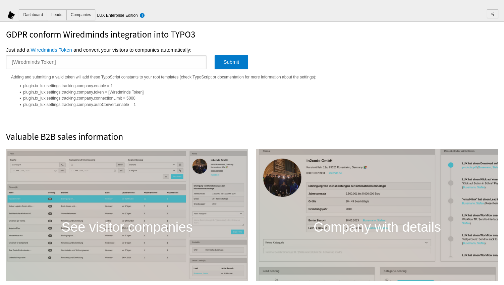
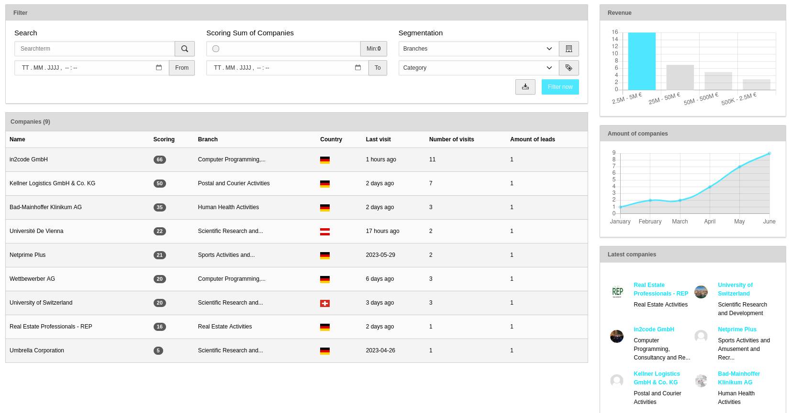
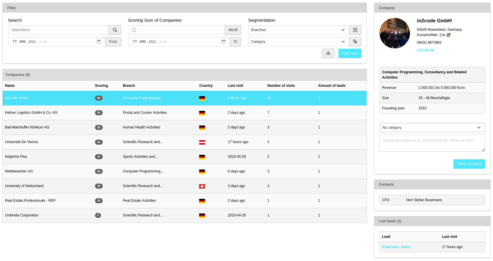
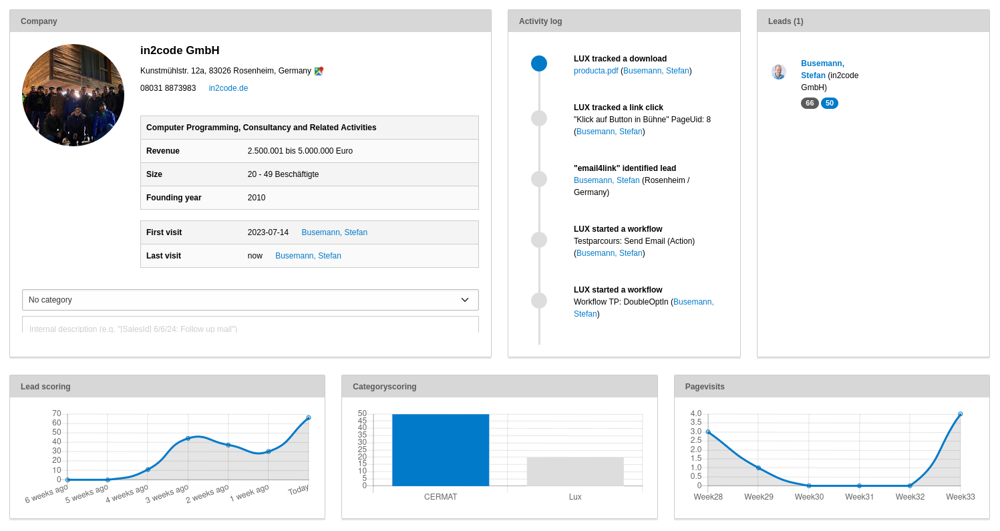
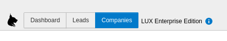
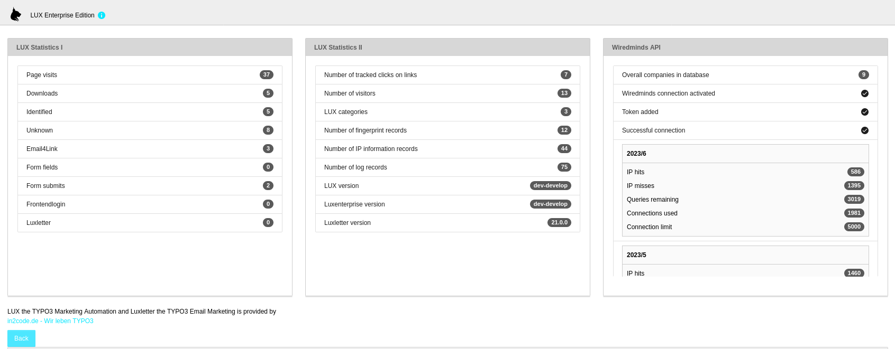

### Backend Module Leads/Companies

Change the view to companies module by clicking on "Companies".

We offer a valuable Wiredminds integration into TYPO3 via LUX. Wiredminds is able to convert an IP-address to company
detail information. This B2B solution takes your website to a whole new level.
Possible information from API is:
* Company name
* Branch
* Revenue
* Size
* Address
* Domain
* Contacts

Wiredminds usage needs to be payed per Request. Look at our website
([How to get a token](https://www.in2code.de/typo3-wiredminds-integration/?utm_campaign=LUX+Community+Version&utm_id=llcv&utm_source=github&utm_medium=browser&utm_content=documentation))
for details about prices and packages and how to get a working token.

**Note:** Not every IP-address can be converted to a company because not every visitor is a business visitor and part of
a company.

#### Company Detection not yet enabled

If you enter the page on your first time, there is a note, that a token is missing. Once you add a Wiredminds token,
some TypoScript constants are set and company detection is activated.

#### Enabled company detection

Once you added a valid token, you are able to convert visitors to companies.

##### Configuration

1) Ensure that server is able to reach the Interface URL `https://ip2c.wiredminds.com` (maybe firewall settings needs to be adjusted).

2) Add a basic API configuration via **TypoScript constants**:

| Constant                                                                | Description                                                                                                                                                                      |
|-------------------------------------------------------------------------|----------------------------------------------------------------------------------------------------------------------------------------------------------------------------------|
| `{$plugin.tx_lux.settings.tracking.company.enable}`                     | Enable or disable Wiredminds connection in general.                                                                                                                              |
| `{$plugin.tx_lux.settings.tracking.company.token}`                      | Add a valid and working wiredmind token.                                                                                                                                         |
| `{$plugin.tx_lux.settings.tracking.company.connectionLimit}`            | Define a limit for monthly requests against wiredmind for full cost control.                                                                                                     |
| `{$plugin.tx_lux.settings.tracking.company.connectionLimitPerHour}`     | Define a limit for hourly requests against wiredmind for savety reasons (e.g. to prevent unneeded requests in case of a DoS attack)                                              |
| `{$plugin.tx_lux.settings.tracking.company.autoConvert.enable}`         | Turn on, that visitors are automatically extended with company information. So, the first visit of a visitor will call the Wiredminds interface and ask for company information. |
| `{$plugin.tx_lux.settings.tracking.company.autoConvert.minimumScoring}` | Use autoConvert only for visitors with a minimum scoring value.                                                                                                                  |

##### User Interface

###### Filter

As you may already know from other filters in LUX, you can filter the list to your needs.

**Note** Category can only be used if you have added some sys_category records to your system.

###### List

Companies are listed with name, scoring (cumulative scoring of all related leads), category scoring (cumulative scoring
of all related leads), Branch name, Country, The Latest visit, Number of all visits and amount of related leads.

###### Right side

A revenue diagram helps you to get a feeling about the average revenue of the listed companies

Another diagram shows you the development of saved companies in your system

A third box shows you the newest companies in your system

The last box gives you a feedback about how many requests already been sent to Wiredminds interface and how much is
left before the monthly limit is reached. The limit can be adjusted via TypoScript and is also related to the
token limit itself.

#### Company Preview

By selecting a line in the list view, you will see a company preview on the right side. Some basic information like
Revenue, Size or Founding year is shown.

If you have added some sys_category records, you can set a category for the company.
You can also add an internal description to the company.

An additional box will show you a basic contact information about the company.

The third box will show you the newest leads of the company.

#### Company Detail View

By clicking "Show company" a detail view will show up. There are similar information in this view as you may already
know from the lead detail view.

An information box will show you interesting information about the company itself. Beside that an activity log and a
lead list will appear. In the line below there are 3 boxes with scoring, category scoring and pagevisit information.

By clicking "Remove company" the company will be deleted in database. If you are clicking "Remove company and visitors",
also related leads are deleted.

#### Statistics

By clicking the i-Icon in the navigation bar, a basic statistic is visible.

In the third column you will have full control about how many requests are already sent to Wiredminds interface and
how many requests are left.

**Note** Not every IP-address can be converted into a company (see *IP hits* vs. *IP misses*)
