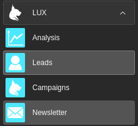
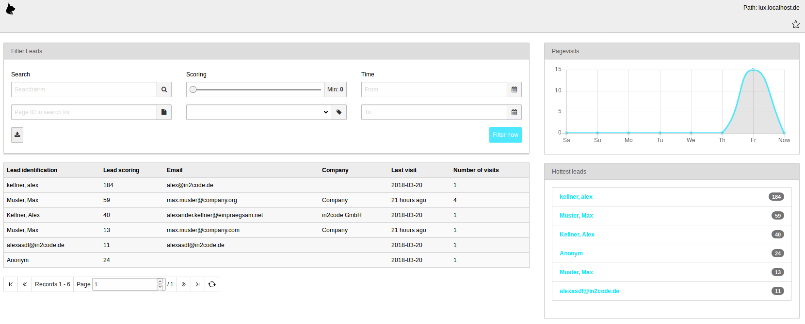
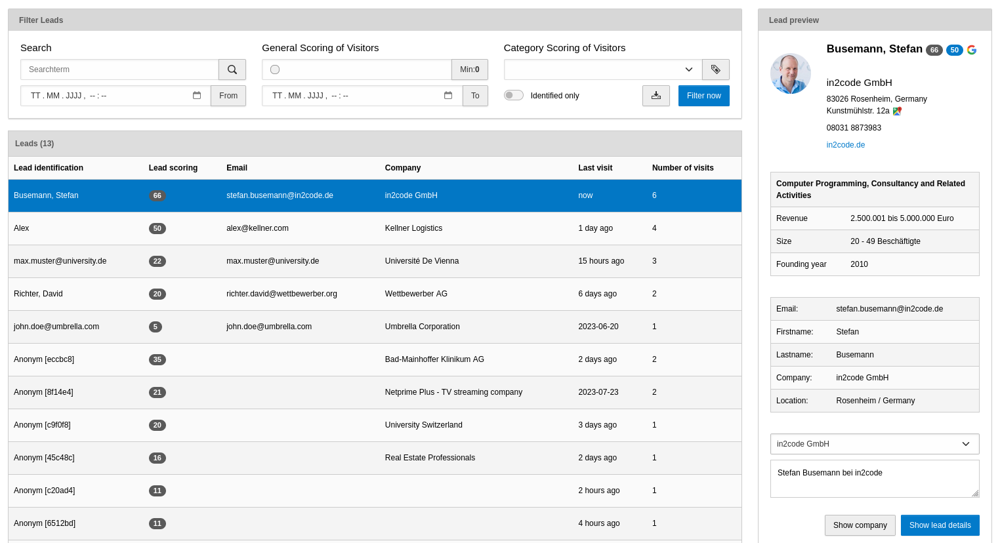
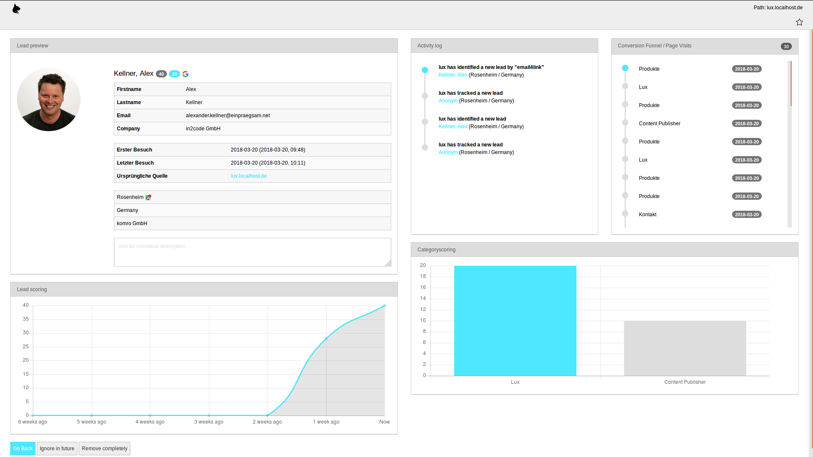

### Backend Module Leads

The backend module Leads show you all identified (and anonymous) leads.

See all your leads in a listview on the left side while you can see useful lead information on the right side
(number of page visits and hottest leads). The left side itself is splitted into a filter area and the table-list-view
below.

#### Filter

| Field                     | Description                                                                                                              |
| ------------------------- | ------------------------------------------------------------------------------------------------------------------------ |
| Searchterm                | Use this fulltext search field for filtering (name, email, company, cookieId, etc...)                                    |
| Page ID                   | Show only leads that visited a page (Table columns change - pagevisits available now)                                    |
| Scoring                   | Search for leads with a minimum scoring                                                                                  |
| Category-Scoring          | Show only leads that have a category-scoring of a given category (Table columns change - Categoryscoring will be available) |
| Time-From                 | Search for leads that are only known since a defined date and time                                                       |
| Time-To                   | Search for leads that are only active until a defined date and time                                                      |

**Filter Buttons**
Filter now: Let's filter the table with our properties
Reset filter: Let's reset the table to original list view
Download button: The download button let you download the lead table in format CSV

#### Table

The table will show you your website leads.

| Column                    | Description                                                                                                              |
| ------------------------- | ------------------------------------------------------------------------------------------------------------------------ |
| Lead identification       | Use this fulltext search field for filtering (name, email, company, cookieId, etc...)                                    |
| Lead scoring              | Show only leads that visited a page (Table rows change - pagevisits available now)                                       |
| Email                     | Search for leads with a minimum scoring                                                                                  |
| Company                   | Show only leads that have a category-scoring of a given category (Table rows change - Categoryscoring will be available) |
| Last visit                | Search for leads that are only known since a defined date and time                                                       |
| Number of visits          | Search for leads that are only active until a defined date and time                                                      |
| Pagevisits                | Only viewable if you filter for a page (will replace column *Number of visits*)                                          |
| Categoryscoring           | Only viewable if you filter for a scoring of a category                                                                  |

**Orderings:** Per default the orderings is identified leads first and after that sort by scoring. The orderings can
be change if you are using a special filter.

#### Detail Preview

If you click in a table row, a small lead preview will be loaded via AJAX. Both diagrams on the right side will be
replaced with a preview box and a scoring box.

If you add a text into the textarea *Add an individual description*, this notice is saved automaticly if the focus gets
lost on the field (on blur).

Clicking on *Show lead details* will open the detail page.

#### Detail View

The detail view will give you a couple of information of the chosen lead. The view is splitted into 7 boxes:
* Lead information overview
* Lead scoring
* Activity log
* Conversion funnel / Page visits
* Categoryscoring
* Lead properties
* Profiles

##### Lead information

See all relevant lead information.

It starts with the *Lead identification*. Depending on the information we have, this
will show the email or the first- and lastname or simply "Anonymous".
Beside this, you will see the general scoring and the hottest category scoring (if there is one). A click on the google
icon will open a new tab with google and let you search for the lead.

After the first line, there are information that came from field mapping, meta information (first and last
visit) and information enriched by the visitors IP-address. The description field is also shown and can be used in the
same way as described in *Detail Preview*.

##### Lead scoring

See the lead scoring of the lead in the last 6 weeks. That gives you the possibility to decide, how your nurturing
workflows are running.

**Note:** The scoring calculation can be done in the Extension Manager settings of the extension. If you are using
the value *lastVisitDaysAgo*, you should use a CommandController to calculate the lead scoring one time a day.

##### Activity log

See the most interesting activities of this lead related to lux. You will see information like *Lead gets identified*,
*Lead gets identified by email4link" or "Lead downloads an asset". Also every workflow that takes action on this lead
is listed here.

**Tipp:** Use your mousecursor for getting a date and time in a tooltip to every activity.

##### Conversion funnel / Page visits

See from which referrer your lead start to visit your website and follow page by page.

##### Categoryscoring

See a diagram with all available categoryscorings for this lead.

**Note:** The calculation can be influenced by the Extension Manager settings of the extension.
**Note:** See [Categoryscorings](../Categoryscorings/Index.md) how to use category scoring in lux.

##### Lead Properties

If you collect more data then just email, firstname, lastname and company (see identification part of the documenation)
You need also to see this information. And this view shows you all collected attributes from the visitor.

##### Profiles

Because your lead could use more then just one device, all cookies and devices are listed here with some additional
information.

##### Interaction Buttons

On the bottom of the detail view, you will find three buttons.

* Go back: Browser will show the previous page
* Blacklist: This lead will be blacklisted on. This means, the lead is not visible in any view any more. This is helpful, if you identify a searchengine crawler (maybe with a high scoring). In addition all properties and related tables are cleaned!
* Remove completely: This will remove all information about this lead from your system. Remove means that the records are really remove - not only a deleted=1!
