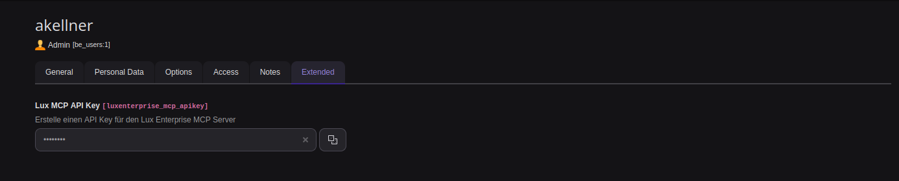
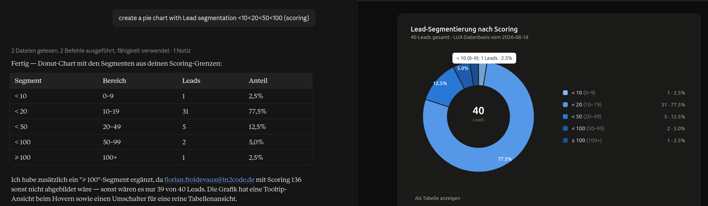

# MCP server of LUXenterprise

**NOTE:** This mcp is only part of the enterprise version

LUXenterprise offers a [MCP](https://modelcontextprotocol.io) server (Model Context Protocol), so that AI clients
like Claude Code, Claude Desktop, VS Code or any other MCP client can read the marketing data of your TYPO3
installation. All tools that are used by the AI chatbot of LUXenterprise are automatically offered as MCP tools.

---

## Configuration

### Prerequisites
You need to enable the MCP server in the backend settings first. See [For Administrators](#for-administrators).

### 1. Create an api key

Every backend user has its own api key in the backend user record(field "Lux MCP Server API Key").



A MCP client acts with the permissions of the backend user of the api key, so the data of the tools is restricted
in the same way as in the LUX backend modules. Deleting the api key of a backend user (or disabling the user)
revokes the access immediately.

### 2. Connect a client

Example for a registration in Claude Code:

```bash
claude mcp add --transport http luxenterprise https://your-domain.org/typo3/mcp/lux \
  --header "Api-Key: <apikey>"
```

Example for a configuration file of a MCP client:

```json
{
  "mcpServers": {
    "luxenterprise": {
      "type": "http",
      "url": "https://your-domain.org/typo3/mcp/lux",
      "headers": {
        "Api-Key": "<apikey>"
      }
    }
  }
}
```

A quick check on command line:

```bash
curl -X POST https://your-domain.org/typo3/mcp/lux \
  -H 'Content-Type: application/json' \
  -H 'Api-Key: <apikey>' \
  -d '{"jsonrpc":"2.0","id":1,"method":"initialize","params":{"protocolVersion":"2025-06-18","capabilities":{},"clientInfo":{"name":"curl","version":"1.0"}}}'
```

The server uses the streamable HTTP transport of MCP (`POST` requests with json-rpc messages) and expects the api
key in one of these headers:

```
Authorization: Bearer <apikey>
Api-Key: <apikey>
```

The `Api-Key` header is a fallback for webserver configurations that do not pass the authorization header to php
(e.g. apache with `mod_proxy_fcgi` without `CGIPassAuth On`).

## First steps

After the MCP server is activated, and the MCP server is configured in your LLM, the server is ready to use.
Now you can use your client to fetch and analyze any lux-related data from your instance.

To get an idea about what you can do with the mcp server, ask your LLM client: `What tools are provided by lux?`
From there you can explore the capabilities of the MCP server.

Here is an example Screenshot of a chat displaying a chart based on the current leads scoring in the instance:



## For Administrators

### Activate the MCP server

| Setting     | Description              | Default |
|-------------|--------------------------|---------|
| `mcpServer` | Activates the MCP server | `0`     |

The endpoint of the server is `/typo3/mcp/lux`. It is located in the backend context, because the tools of
LUXenterprise need a backend user to decide which visitors and pages can be read.

### Rate limiting

The rate limit can be configured with
`$GLOBALS['TYPO3_CONF_VARS']['SYS']['rateLimiter']['luxenterprise-mcp']` (keys `limit` and `interval`).
A successful authentication resets the limit, so only failing requests are counted.

### Error responses

| Status | Meaning                                                                                     |
|--------|---------------------------------------------------------------------------------------------|
| `401`  | No or an invalid api key was sent                                                            |
| `403`  | The backend user of the api key has no access to the LUX modules                             |
| `429`  | Too many failed authentications from this ip address (20 in 15 minutes by default)           |
| `405`  | The request method is not supported (only `POST`, `DELETE` and `OPTIONS`)                     |


---
