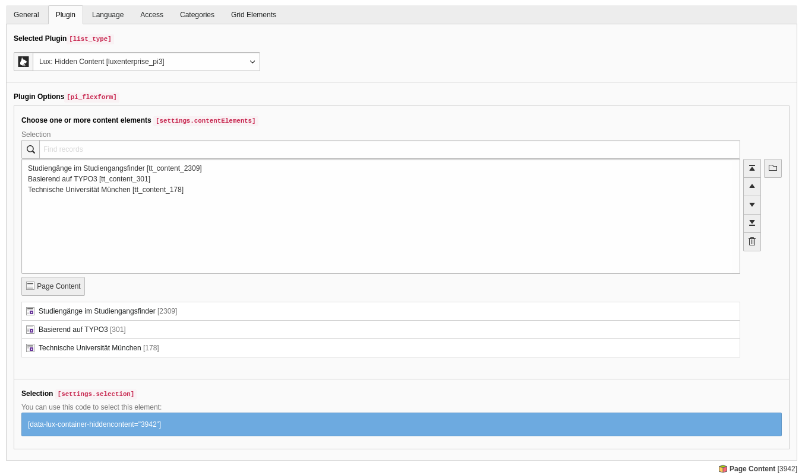

### Plugins and Pageoverview

This part of the documentation describes all lux plugins and the pageoverview view in backend.

#### Pageoverview

If you have activated pageoverview in Extension Manager settings of extension lux, you and your editors will get
important information about your visitor and leads.

You can decide what view should be rendered via Extension Manager settings.

##### Analysis

If your installation is configured to show a analysis overview, you will see how this page is performing in this week
compared to the week before.

By clicking on the title you can show or hide (toggle) this information for the current backend user.
Of course this status is saved if you change the page or logout and login later again.

##### Leads

If your installation is configured to show the latest leads, you will see visitors of the current page (Identified and
Anonymous) in page module.

By clicking on "Latest Leads" you can show or hide (toggle) this information for the current backend user.
Of course this status is saved if you change the page or logout and login later again.

#### Plugins

##### Plugin 1: Opt out

The first plugin in lux fits ideally to your privacy notes page. As you may not from Matomo (former known as Piwik) Lux
also offers a checkbox in frontend where visitors can de-check if they don't want to be tracked.

If the browser has a *DoNotTrack* setting enabled, the view changes a bit.

You can simply add a Plugin Pi1 *trackingOptOut* to a page and add some content to it.

*Note*: If you want to use opt-in instead of opt-out functionality, there is a possibility for this
(see [Privacy](../../Privacy/Index.md)).

##### Plugin 2: Contextual content

**NOTE:** This plugin is only part of the enterprise version:
[Look at in2code.de for more information](https://www.in2code.de/produkte/lux-typo3-marketing-automation/?utm_campaign=LUX+Community+Version&utm_id=llcv&utm_source=github&utm_medium=browser&utm_content=documentation+plugins+cc)

Another possibility beside workflow actions to nurture leads is to use a contextual content plugin. If you add
this to a page, you can define a default content element and you can define one or more content elements per
lux-category.
An asynchronous request (AJAX of course for high performance website not a USER_INT) will show the most relevant
content element - related to the category scoring of the current visitor.

If you have added more then only one content element per category, the content element is selected randomly.

##### Plugin 3: Hidden content

**NOTE:** This plugin is only part of the enterprise version:
[Look at in2code.de for more information](https://www.in2code.de/produkte/lux-typo3-marketing-automation/?utm_campaign=LUX+Community+Version&utm_id=llcv&utm_source=github&utm_medium=browser&utm_content=documentation+plugins+hc)

This plugin allows you to add invisible content elements on your page. Those can be shown via workflow action.

