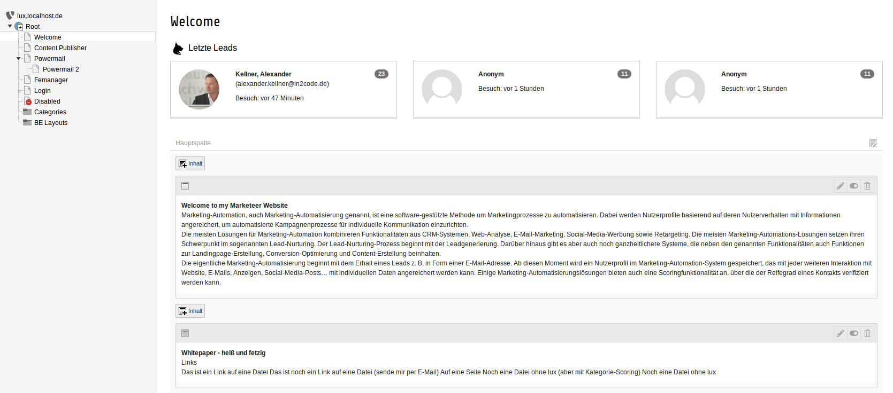
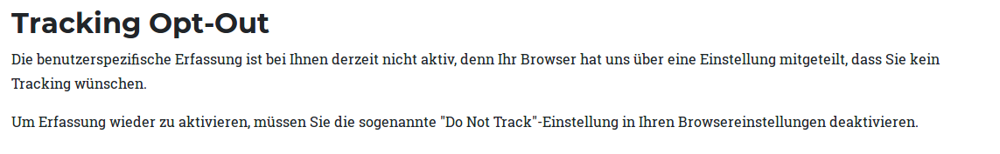
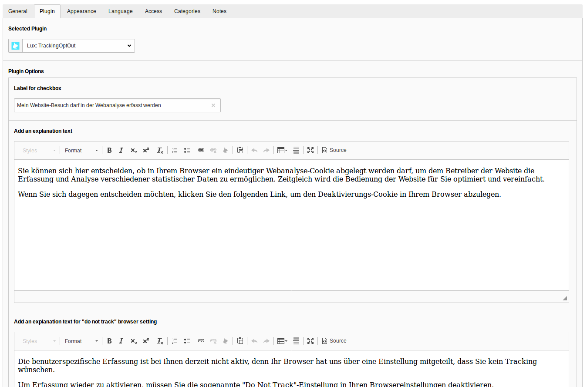
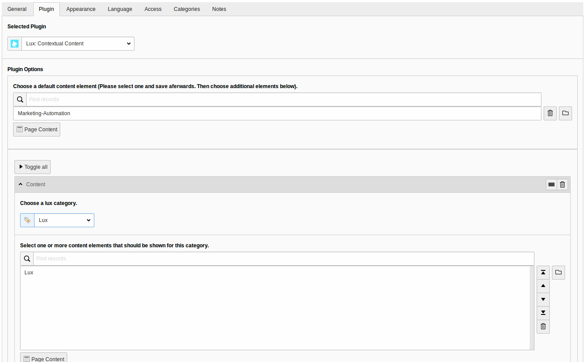

### Plugins and Pageoverview

This part of the documentation describes all lux plugins and the pageoverview view in backend.

#### Pageoverview

If you have activated pageoverview in Extension Manager settings of extension lux, you will see the last three
leads (Identified and Anonymous) of a page in page module.

#### Plugins

##### Plugin 1: Opt out

The first plugin in lux fits ideally to your privacy notes page. As you may not from Matomo (former known as Piwik) Lux
also offers a checkbox in frontend where visitors can de-check if they don't want to be tracked.

If the browser has a *DoNotTrack* setting enabled, the view changes a bit.

You can simply add a Plugin Pi1 *trackingOptOut* to a page and add some content to it.

*Note*: If you want to use opt-in instead of opt-out functionality, there is a possibility for this 
(see [Privacy](../../Privacy/Index.md)).

##### Plugin 2: Contextual content

**NOTE:** This plugin is only part of the enterprise version. Look at 
https://www.in2code.de/produkte/lux-typo3-marketing-automation/ for more information.

Another possibility beside workflow actions to nurture leads is to use a contextual content plugin. If you add
this to a page, you can define a default content element and you can define one or more content elements per
lux-category.
An asynchronous request (AJAX of course for high performance website not a USER_INT) will show the most relevant
content element - related to the category scoring of the current visitor.

If you have added more then only one content element per category, the content element is selected randomly.

