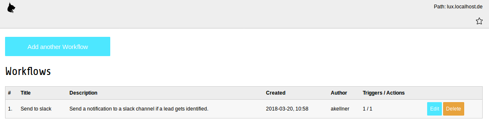
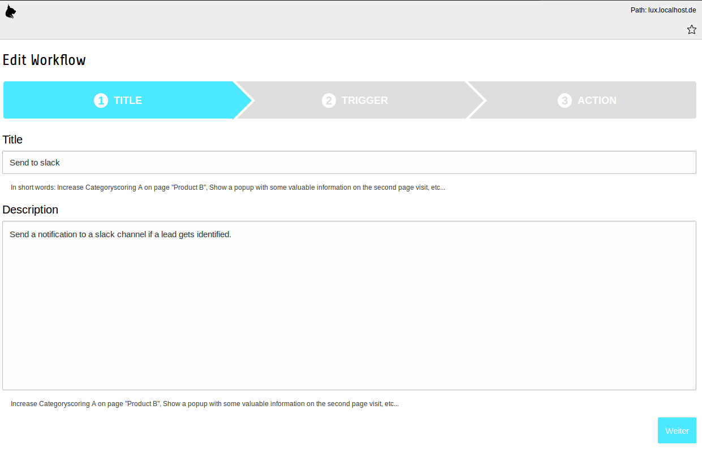
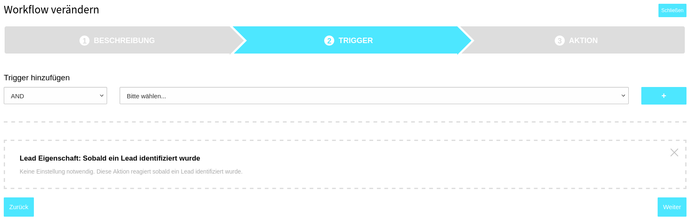
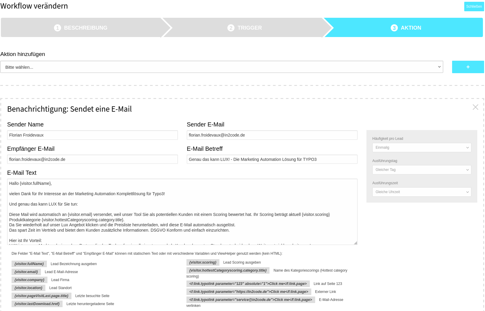
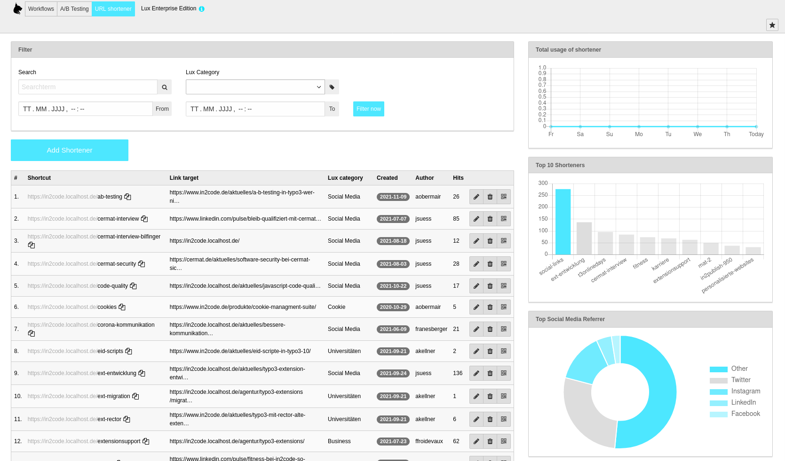

### Workflows and URL shortener

**NOTE:** This module is only part of the enterprise version. Look at
https://www.in2code.de/produkte/lux-typo3-marketing-automation/ for more information.

What can be done with workflows? Look into our blog for some inspiration

* [Tip 1: Lead notification workflow](https://www.in2code.de/en/recent/marketing-automation-tip-1-lead-notification-workflow/)
* [Tip 2: How to quickly build landing pages](https://www.in2code.de/en/recent/marketing-automation-tip-2-create-landing-pages-quickly/)
* [Tip 3: Newsletter registration in email4link](https://www.in2code.de/en/recent/marketing-automation-tip-3-newsletter-registrierung-mit-downloads-verbinden/)
* [Tip 4: Show relevant content](https://www.in2code.de/en/recent/marketing-automation-tip-4-show-relevant-content/)

#### Workflow view

This part of the manual describes how to manage workflows in lux backend module.

A workflow is a technique to nurture your leads. Let's say a lead that reaches a category scoring of 25 in a category
*Product A* should see a special offer in a popup (lightbox)? Or maybe you want to redirect a lead to a different page
if he/she visits the page the second time? Lux will help you to build your own and individual workflows.

##### List view

If you open the backend module workflows and you have not added any workflows yet, the only interaction possibility for
you is to add a new workflow. If you have already added one or more workflows, you will see a list of your existing
workflows.



Existing workflows can be deleted or edited by clicking the buttons.
If you edit an existing workflow or if you add a new workflow, you will see a form that is splitted into three
different steps.

##### 1 Title

Define a title and an internal description for your new workflow:


After that you can choose next for step 2.

##### 2 Trigger

A trigger is a condition for a possible event or action.
You can choose one or more triggers (and combine them logical with AND or OR) that
should result in an action (see 3 Action).

Choose a trigger and click on the **+** button. Now a new trigger configuration was added. Depending on the trigger that
you have chosen, it's possible to add values to the trigger itself. In this example, we choose the *If a lead gets
identified* trigger - no values to add here:


Possible triggers by default are:
* Lead properties: If a lead gets identified
* Lead properties: When lead reaches a scoring
* Lead properties: When lead reaches a categoryscoring
* Lead properties: If lead company given
* Lead properties: If any property value is given
* Lead properties: Use your own expressions for doing even mor individual stuff (with Symfony Expression Language)
* Lead action: On entering a page
* Lead action: When lead enters a page of a given category
* Miscellaneous: On a defined time
* Miscellaneous: Limit to a start action (page visit, download, form submit, etc...)
* Miscellaneous: TYPO3 context

After that you can choose next for step 3 or previous for step 1 again.

##### 3 Action

An action is when lux executes a workflow on given conditions (triggers). You can choose one or more actions.
If you choose more actions, all actions will be executed.

Choose an action and click on the **+** button. Now a new action configuration was added. Depending on the action that
you have chosen, it's possible to add values to the action itself. In this example, we choose the *Publish a message
to a slack channel* action.

We can select if this action should be executed only once (default setting) or multiple times
and we can add a text for publishing to a slack channel.



Possible actions by default are:
* Content manipulation: Open a popup (lightbox) with a content element
* Content manipulation: Load a content element and show it on the current page
* Content manipulation: Hide or show an element of the current page
* Content manipulation: Redirect visitor to another page
* Notification: Sends an email
* Notification: Publish a message to a slack channel
* Lead management: Sets a value for a visitor
* Lead management: Sets a value after a double opt in confirmation for a visitor
* Lead management: Add a visitor to a blacklist
* Data handling: Save values to any table in database
* Data handling: Send lead information to any interface (e.g. a CRM)

After that you can choose save or previous for step 2 again.

##### TypoScript Configuration

There is a default TypoScript configuration that will be added if you add the Lux Static Template to your root template.
Depending on the triggers and actions that you're using, you can enrich some of them with configuration in TypoScript.
If you want to publish to a slack channel, a webhook URL is needed e.g.

Triggers:
```
lib.lux.settings {

    # All workflow settings
    workflow {

        ############################
        # Define individual triggers
        ############################
        triggers {

            # 100-399 LEAD PROPERTIES
            # If lead gets identified
            100 {
                # Title to show in workflow backend module
                title = LLL:EXT:luxenterprise/Resources/Private/Language/locallang_db.xlf:trigger.identified

                # Classname for implementation of the trigger itself
                className = In2code\Luxenterprise\Domain\Trigger\IdentifiedTrigger

                # Templatefile for implementation of the form in workflow module
                templateFile = EXT:luxenterprise/Resources/Private/Templates/Workflow/Trigger/Identified.html

                # Additional configuration
                configuration {
                  # Any configuration - available as array in Template File and Trigger class for some own magic
                }
            }

            # If lead reaches a scoring
            110 {
                # Title to show in workflow backend module
                title = LLL:EXT:luxenterprise/Resources/Private/Language/locallang_db.xlf:trigger.scoring

                # Classname for implementation of the trigger itself
                className = In2code\Luxenterprise\Domain\Trigger\ScoringTrigger

                # Templatefile for implementation of the form in workflow module
                templateFile = EXT:luxenterprise/Resources/Private/Templates/Workflow/Trigger/Scoring.html

                # Additional configuration
                configuration {
                  # Any configuration - available as array in Template File and Trigger class for some own magic
                }
            }

            # If lead reaches a categoryscoring
            120 {
                # Title to show in workflow backend module
                title = LLL:EXT:luxenterprise/Resources/Private/Language/locallang_db.xlf:trigger.categoryscoring

                # Classname for implementation of the trigger itself
                className = In2code\Luxenterprise\Domain\Trigger\CategoryScoringTrigger

                # Templatefile for implementation of the form in workflow module
                templateFile = EXT:luxenterprise/Resources/Private/Templates/Workflow/Trigger/CategoryScoring.html

                # Additional configuration
                configuration {
                  # Any configuration - available as array in Template File and Trigger class for some own magic
                }
            }

            # If company of a lead is known (e.g. from IP-Information)
            130 {
                # Title to show in workflow backend module
                title = LLL:EXT:luxenterprise/Resources/Private/Language/locallang_db.xlf:trigger.company

                # Classname for implementation of the trigger itself
                className = In2code\Luxenterprise\Domain\Trigger\CompanyTrigger

                # Templatefile for implementation of the form in workflow module
                templateFile = EXT:luxenterprise/Resources/Private/Templates/Workflow/Trigger/Company.html

                # Additional configuration
                configuration {
                  # Any configuration - available as array in Template File and Trigger class for some own magic
                }
            }

            # If property of a lead matches with a given string
            140 {
                # Title to show in workflow backend module
                title = LLL:EXT:luxenterprise/Resources/Private/Language/locallang_db.xlf:trigger.property

                # Classname for implementation of the trigger itself
                className = In2code\Luxenterprise\Domain\Trigger\PropertyTrigger

                # Templatefile for implementation of the form in workflow module
                templateFile = EXT:luxenterprise/Resources/Private/Templates/Workflow/Trigger/Property.html

                # Additional configuration
                configuration {
                  # Any configuration - available as array in Template File and Trigger class for some own magic
                }
            }

            # Symfony Expression Trigger for doing individual magic stuff with lead properties (compare with GET params, check if visitor country is in a list, etc...)
            150 {
                # Title to show in workflow backend module
                title = LLL:EXT:luxenterprise/Resources/Private/Language/locallang_db.xlf:trigger.symfonyExpression

                # Classname for implementation of the trigger itself
                className = In2code\Luxenterprise\Domain\Trigger\SymfonyExpressionTrigger

                # Templatefile for implementation of the form in workflow module
                templateFile = EXT:luxenterprise/Resources/Private/Templates/Workflow/Trigger/SymfonyExpression.html

                # Additional configuration
                configuration {
                  # Any configuration - available as array in Template File and Trigger class for some own magic
                }
            }


            # 400-699 LEAD ACTION
            # If lead visits a defined page
            400 {
                # Title to show in workflow backend module
                title = LLL:EXT:luxenterprise/Resources/Private/Language/locallang_db.xlf:trigger.pagevisit

                # Classname for implementation of the trigger itself
                className = In2code\Luxenterprise\Domain\Trigger\PageVisitTrigger

                # Templatefile for implementation of the form in workflow module
                templateFile = EXT:luxenterprise/Resources/Private/Templates/Workflow/Trigger/PageVisit.html

                # Additional configuration
                configuration {
                    # Any configuration - available as array in Template File and Trigger class for some own magic
                }
            }

            # If lead enters a page or downloads an asset with a relation to a lux category
            410 {
                # Title to show in workflow backend module
                title = LLL:EXT:luxenterprise/Resources/Private/Language/locallang_db.xlf:trigger.category

                # Classname for implementation of the trigger itself
                className = In2code\Luxenterprise\Domain\Trigger\CategoryTrigger

                # Templatefile for implementation of the form in workflow module
                templateFile = EXT:luxenterprise/Resources/Private/Templates/Workflow/Trigger/Category.html

                # Additional configuration
                configuration {
                  # Any configuration - available as array in Template File and Trigger class for some own magic
                }
            }


            # 700-999 MISCELLANEOUS
            # At a defined time (start to stop)
            700 {
                # Title to show in workflow backend module
                title = LLL:EXT:luxenterprise/Resources/Private/Language/locallang_db.xlf:trigger.timeframe

                # Classname for implementation of the trigger itself
                className = In2code\Luxenterprise\Domain\Trigger\TimeFrameTrigger

                # Templatefile for implementation of the form in workflow module
                templateFile = EXT:luxenterprise/Resources/Private/Templates/Workflow/Trigger/TimeFrame.html

                # Additional configuration
                configuration {
                  # Any configuration - available as array in Template File and Trigger class for some own magic
                }
            }

            # Define the initial action for triggering (page visit or download or form submit, etc...)
            710 {
                # Title to show in workflow backend module
                title = LLL:EXT:luxenterprise/Resources/Private/Language/locallang_db.xlf:trigger.startaction

                # Classname for implementation of the trigger itself
                className = In2code\Luxenterprise\Domain\Trigger\StartactionTrigger

                # Templatefile for implementation of the form in workflow module
                templateFile = EXT:luxenterprise/Resources/Private/Templates/Workflow/Trigger/Startaction.html

                # Additional configuration
                configuration {
                    actions {
                        0 = pageRequestAction
                        1 = fieldListeningRequestAction
                        2 = formListeningRequestAction
                        3 = email4LinkRequestAction
                        4 = downloadRequestAction
                        5 = linkListenerRequestAction
                        6 = error
                    }
                }
            }

            # Define TYPO3 context (e.g. to use workflows only on production)
            720 {
                # Title to show in workflow backend module
                title = LLL:EXT:luxenterprise/Resources/Private/Language/locallang_db.xlf:trigger.context

                # Classname for implementation of the trigger itself
                className = In2code\Luxenterprise\Domain\Trigger\ContextTrigger

                # Templatefile for implementation of the form in workflow module
                templateFile = EXT:luxenterprise/Resources/Private/Templates/Workflow/Trigger/Context.html

                # Additional configuration
                configuration {
                    contexts {
                        0 = Production
                        1 = Development
                        2 = Testing
                    }
                }
            }
        }
    }
}
```

**Note:** Take care that your lib.lux configuration is recognized by lux (see FAQ section how to copy it to plugin.tx_lux_fe)

Actions:
```
lib.lux.settings {

    # All workflow settings
    workflow {

        ###########################
        # Define individual actions
        ###########################
        actions {

            # 100-199 CONTENT MANIPULATION
            # Action for showing an individual content element in a lightbox to the lead
            100 {
                # Title to show in workflow backend module
                title = LLL:EXT:luxenterprise/Resources/Private/Language/locallang_db.xlf:action.popupcontentelement

                # Classname for implementation of the action itself
                className = In2code\Luxenterprise\Domain\Action\PopupContentElementAction

                # Templatefile for implementation of the form in workflow module
                templateFile = EXT:luxenterprise/Resources/Private/Templates/Workflow/Action/PopupContentElement.html

                # Additional configuration
                configuration {
                    # Any configuration - available as array in Template File and Action class for some own magic
                }
            }

            # Action for loading an individual content element into the current HTML page
            120 {
                # Title to show in workflow backend module
                title = LLL:EXT:luxenterprise/Resources/Private/Language/locallang_db.xlf:action.ajaxcontent

                # Classname for implementation of the action itself
                className = In2code\Luxenterprise\Domain\Action\AjaxContentElementAction

                # Templatefile for implementation of the form in workflow module
                templateFile = EXT:luxenterprise/Resources/Private/Templates/Workflow/Action/AjaxContentElement.html

                # Additional configuration
                configuration {
                    # Any configuration - available as array in Template File and Action class for some own magic
                }
            }

            # Show or hide any element on a HTML page
            130 {
                # Title to show in workflow backend module
                title = LLL:EXT:luxenterprise/Resources/Private/Language/locallang_db.xlf:action.showOrHide

                # Classname for implementation of the action itself
                className = In2code\Luxenterprise\Domain\Action\ShowOrHideAction

                # Templatefile for implementation of the form in workflow module
                templateFile = EXT:luxenterprise/Resources/Private/Templates/Workflow/Action/ShowOrHide.html

                # Additional configuration
                configuration {
                    # Any configuration - available as array in Template File and Action class for some own magic
                }
            }

            # Action for doing a redirect to another URI
            140 {
                # Title to show in workflow backend module
                title = LLL:EXT:luxenterprise/Resources/Private/Language/locallang_db.xlf:action.redirect

                # Classname for implementation of the action itself
                className = In2code\Luxenterprise\Domain\Action\RedirectAction

                # Templatefile for implementation of the form in workflow module
                templateFile = EXT:luxenterprise/Resources/Private/Templates/Workflow/Action/Redirect.html

                # Additional configuration
                configuration {
                    emailOverrides {
                        # Any configuration - available as array in Template File and Action class for some own magic
                    }
                }
            }


            # 200-299 SEND MESSAGES
            # Action for sending a notification email
            200 {
                # Title to show in workflow backend module
                title = LLL:EXT:luxenterprise/Resources/Private/Language/locallang_db.xlf:action.email

                # Classname for implementation of the action itself
                className = In2code\Luxenterprise\Domain\Action\EmailAction

                # Templatefile for implementation of the form in workflow module
                templateFile = EXT:luxenterprise/Resources/Private/Templates/Workflow/Action/Email.html

                # Additional configuration
                configuration {
                    emailOverrides {
                        # Override sender settings for SPF-defiance settings (affected only the sender settings - not the reply to settings)
                        senderName = Marketing
                        senderEmail = service@domain.org
                    }
                }
            }

            # Action for publishing to a slackchannel
            210 {
                # Title to show in workflow backend module
                title = LLL:EXT:luxenterprise/Resources/Private/Language/locallang_db.xlf:action.slack

                # Classname for implementation of the action itself
                className = In2code\Luxenterprise\Domain\Action\SlackAction

                # Templatefile for implementation of the form in workflow module
                templateFile = EXT:luxenterprise/Resources/Private/Templates/Workflow/Action/Slack.html

                # Additional configuration
                configuration {

                    # Define multiple configurations - one per slack channels or slack domain
                    1 {
                        # Add a name for a selection in workflow backend module
                        name = Slack Channel "Sales"

                        # Add your webhook Url like https://hooks.slack.com/services/token
                        webhookUrl = https://hooks.slack.com/services/TOKENabcdefghi123456/789123456/7891

                        # Username for this webhook
                        username = lux

                        # Set an emoji for all this publishings (can be empty, if you already set an image to your webhook in slack)
                        emoji = :fire:
                    }
                }
            }


            # 300-399 MANIPULATION OF VALUES
            # Set a value for a visitor
            300 {
                # Title to show in workflow backend module
                title = LLL:EXT:luxenterprise/Resources/Private/Language/locallang_db.xlf:action.property

                # Classname for implementation of the action itself
                className = In2code\Luxenterprise\Domain\Action\PropertyAction

                # Templatefile for implementation of the form in workflow module
                templateFile = EXT:luxenterprise/Resources/Private/Templates/Workflow/Action/Property.html

                # Additional configuration
                configuration {
                    # Any configuration - available as array in Template File and Action class for some own magic
                }
            }

            # Double Opt-In for visitors
            310 {
                # Title to show in workflow backend module
                title = LLL:EXT:luxenterprise/Resources/Private/Language/locallang_db.xlf:action.doubleoptin

                # Classname for implementation of the action itself
                className = In2code\Luxenterprise\Domain\Action\DoubleOptInAction

                # Templatefile for implementation of the form in workflow module
                templateFile = EXT:luxenterprise/Resources/Private/Templates/Workflow/Action/DoubleOptIn.html

                # Additional configuration
                configuration {
                  emailOverrides {
                    # Override sender settings for SPF-defiance settings (affected only the sender settings - not the reply to settings)
                    senderName = Marketing
                    senderEmail = service@domain.org
                  }
                }
            }

            # Set a blacklisted status
            320 {
                # Title to show in workflow backend module
                title = LLL:EXT:luxenterprise/Resources/Private/Language/locallang_db.xlf:action.blacklist

                # Classname for implementation of the action itself
                className = In2code\Luxenterprise\Domain\Action\BlacklistAction

                # Templatefile for implementation of the form in workflow module
                templateFile = EXT:luxenterprise/Resources/Private/Templates/Workflow/Action/Blacklist.html

                # Additional configuration
                configuration {
                    # Any configuration - available as array in Template File and Action class for some own magic
                }
            }


            # 400-499 WORKING WITH LEAD VALUES (THIRD PARTY API AND TABLES)
            # Save values to a local table
            400 {
                # Title to show in workflow backend module
                title = LLL:EXT:luxenterprise/Resources/Private/Language/locallang_db.xlf:action.saveToTable

                # Classname for implementation of the action itself
                className = In2code\Luxenterprise\Domain\Action\SaveToTableAction

                # Templatefile for implementation of the form in workflow module
                templateFile = EXT:luxenterprise/Resources/Private/Templates/Workflow/Action/SaveToTable.html

                # Additional configuration
                configuration {
                    1 {
                        # Any title for this table save action
                        name = Save as Frontend User

                        # Table name to save in
                        table = fe_users

                        # If identifierField is filled and there is already a record with the same value, it will be updated instead of inserted (twice). NOTE: This fieldname must be defined in mapping!
                        identifierField = email

                        # Map: fe_users.fieldname = value
                        mapping {
                            pid = 190
                            tstamp = {f:format.date(date:'now',format:'U')}
                            crdate = {f:format.date(date:'now',format:'U')}
                            username = {visitor.email}
                            password = {lux:string.getRandomValue()}
                            usergroup = 1,2
                            name = {visitor.fullName}
                            first_name = {lux:visitor.getAnyProperty(visitor:visitor,property:'firstname')}
                            last_name = {lux:visitor.getAnyProperty(visitor:visitor,property:'lastname')}
                            telephone = {lux:visitor.getAnyProperty(visitor:visitor,property:'telephone')}
                            email = {visitor.email}
                            company = {visitor.company}
                        }
                    }
                }
            }

            # Send to interface action for any kind of exports to a CRM
            410 {
                # Title to show in workflow backend module
                title = LLL:EXT:luxenterprise/Resources/Private/Language/locallang_db.xlf:action.sendtointerface

                # Classname for implementation of the action itself
                className = In2code\Luxenterprise\Domain\Action\SendToInterfaceAction

                # Templatefile for implementation of the form in workflow module
                templateFile = EXT:luxenterprise/Resources/Private/Templates/Workflow/Action/SendToInterface.html

                # Additional configuration
                configuration {
                    1 {
                        # Any title for this interface connection
                        name = Send lead to my CRM

                        # Send to this url
                        url = https://mycrm.net

                        values {
                            # build a string like &email=email@address.net&name=Alex&scoring=123 ...
                            email = {visitor.email}
                            name = {visitor.fullName}
                            scoring = {visitor.scoring}
                            country = {visitor.country}
                            company = {visitor.company}
                            anyattribute = {lux:visitor.getPropertyFromAttributes(attribute:'firstname',visitor:visitor)}
                            anyvalue = any static value
                        }
                    }
                }
            }
        }
    }
}
```

**Note:** Take care that your lib.lux configuration is recognized by lux (see FAQ section how to copy it to plugin.tx_lux_fe)

##### Extending Triggers and Actions

Of course we wanted to build a very flexible Marketing Automation tool that can be extended to your needs. So we don't
know all the triggers and actions that you need. But we made it very easy for you to extend the existing list with your
own triggers and actions.

The following examples would require an additional extension and we call it *luxextension*.

###### Add an individual trigger

Let's say you want to add an individual trigger **If a frontend user adds a page**, you should register it via
TypoScript first:

```
lib.lux.settings {

   # All workflow settings
   workflow {

       triggers {

           # Trigger if a frontend user enters a page
           1000 {
               # Title to show in workflow backend module
               title = LLL:EXT:luxextension/Resources/Private/Language/locallang_db.xlf:trigger.frontenduser

               # Classname for implementation of the trigger itself
               className = Vendor\Luxextension\Domain\Trigger\FrontendUserTrigger

               # Templatefile for implementation of the form in workflow module
               templateFile = EXT:luxextension/Resources/Private/Templates/Workflow/Trigger/FrontendUser.html

               # Additional configuration
               configuration {
                   # If a frontenduser is registered in this fe_group
                   group = 1
               }
           }
       }
   }
}
plugin.tx_lux_fe.settings < lib.lux.settings
module.tx_lux.settings < lib.lux.settings
```

A template file will help you to ask the marketing editors for configuration. In our example the trigger should only
work for a selected page. So we need an input field where the editor can add a PID and we name it *page*.

EXT:luxextension/Resources/Private/Templates/Workflow/Trigger/FrontendUser.html:
```
<f:spaceless>
    <f:comment>
        Available variables:
        {index} Index variable for fieldnames
        {triggerSettings.title} Trigger title from TypoScript
        {triggerSettings.description} Trigger description from TypoScript
        {triggerSettings.className} Trigger className from TypoScript
        {triggerSettings.templateFile} Trigger templateFile from TypoScript
        {triggerSettings.configuration.foo} Trigger configuration from TypoScript
    </f:comment>


    <div class="row form-group lux-trigger lux-trigger-conjunction{trigger.conjunction}">
        <button data-lux-action-trigger="delete" class="close" type="button">delete</button>

        <div class="col-md-12">
            <label for="trigger_{index}_page" class="lb-lg">
                <f:translate key="LLL:EXT:luxextension/Resources/Private/Language/locallang_db.xlf:trigger.frontenduser.page">PID</f:translate>
            </label>
            <input
               type="number"
               name="tx_lux_lux_luxworkflow[trigger][{index}][configuration][page]"
               class="form-control"
               id="trigger_{index}_page"
               placeholder="123"
               value="{configuration.page}" />
        </div>

        <input type="hidden" name="tx_lux_lux_luxworkflow[trigger][{index}][className]" value="{triggerSettings.className}" />
        <input type="hidden" name="tx_lux_lux_luxworkflow[trigger][{index}][conjunction]" value="{trigger.conjunction}" />
    </div>
</f:spaceless>
```

Two additional hiddenfields at the end will store the chosen conjunction and the className into database.

Now it's time for some own PHP-magic in the class Vendor\Luxextension\Domain\Trigger\FrontendUserTrigger.
EXT:luxextension/Classes/Domain/Trigger/FrontendUserTrigger.php:

```
<?php
declare(strict_types=1);
namespace Vendor\Luxextension\Domain\Trigger;

use \In2code\Lux\Domain\Trigger\AbstractTrigger;
use \In2code\Lux\Domain\Trigger\TriggerInterface;

/**
 * Class FrontendUserTrigger
 */
class FrontendUserTrigger extends AbstractTrigger implements TriggerInterface
{

    /**
     * @return void
     */
    public function initialize()
    {
        if ((int)$this->getConfigurationByKey('page') === 0) {
            throw new \Exception('No page configuration given', 1522680218);
        }
        if ($this->getSettingsByPath('group') === '') {
            throw new \Exception('No fe_group uid given in TypoScript', 1522680425);
        }
    }

    /**
     * Check if
     * - the current visitor enters the configured page
     * - and if the visitor is logged in as fe_user
     * - and if he/she is logged in in a given fe_group
     *
     * @return bool
     */
    public function isTriggered(): bool
    {
        if ((int)$GLOBALS['TSFE']->id === (int)$this->getConfigurationByKey('page')) {
            $userGroupUid = (int)$this->getSettingsByPath('group');
            $userGroupsFeLogin = explode(',', $GLOBALS['TSFE']->fe_user->user['usergroup']);
            if (!empty($userGroupsFeLogin)) {
                return in_array($userGroupUid, $userGroupsFeLogin);
            }
        }
        return false;
    }
}

```

Your PHP trigger class must implement TriggerInterface and should extend the AbstractTrigger. Last class offers you
useful methods (like getWorkflow(), getTrigger() and getVisitor(), getConfigurationByKey() or getSettingsByPath())
to get helpful information.

The method initialize() is called before isTriggered() and the method afterTrigger() at last.
While you have to add a boolean method isTriggered() the others are optional.


Last but not least, you should add a locallang file with the keys that you've used in TypoScript and in your Trigger
HTML file.


###### Add an individual action

Let's say you want to add an individual action **Send lead values via CURL**, you should register it via
TypoScript first:

```
lib.lux.settings {

    # All workflow settings
    workflow {

        actions {

            # Action to send some details via CURL to a thirdparty software
            1000 {
                # Title to show in workflow backend module
                title = LLL:EXT:luxextension/Resources/Private/Language/locallang_db.xlf:action.curl

                # Classname for implementation of the action itself
                className = Vendor\Luxextension\Domain\Action\CurlAction

                # Templatefile for implementation of the form in workflow module
                templateFile = EXT:luxextension/Resources/Private/Templates/Workflow/Action/Curl.html

                # Additional configuration
                configuration {
                    uri = https://www.thirdpartycrm.org/api/
                }
            }
    }
}
plugin.tx_lux_fe.settings < lib.lux.settings
module.tx_lux.settings < lib.lux.settings
```

A template file will help you to ask the marketing editors for configuration. In our example we just ask for the URI
to send the values to. Per default TypoScript configuration should work but the URI could be overwritten by
a configuration from the marketing editor.
So we need an input field where the editor can add a URI for overwriting and we name it *uri*.

EXT:luxextension/Resources/Private/Templates/Workflow/Action/Curl.html:
```
<f:spaceless>
    <f:comment>
        Available variables:
        {index} Index variable for fieldnames
        {actionSettings.title} Action title from TypoScript
        {actionSettings.description} Action description from TypoScript
        {actionSettings.className} Action className from TypoScript
        {actionSettings.templateFile} Action templateFile from TypoScript
        {actionSettings.configuration.foo} Action configuration from TypoScript
    </f:comment>

    <div class="lux-action">
        <button data-lux-action-trigger="delete" class="close" type="button">delete</button>

        <h1><f:translate key="LLL:EXT:luxextension/Resources/Private/Language/locallang_db.xlf:action.curl" /></h1>

        <div class="row form-group">
            <div class="col-md-3">
                <label for="trigger_{index}_recurring" class="lb-lg">
                    <f:translate key="LLL:EXT:lux/Resources/Private/Language/locallang_db.xlf:action.label.recurring">
                        Recurring/Single
                    </f:translate>
                </label>
                <select name="tx_lux_lux_luxworkflow[actions][{index}][configuration][recurring]" class="form-control" id="trigger_{index}_recurring">
                    <option value="single"{f:if(condition:'{configuration.recurring} == "single"',then:' selected="selected"')}>{f:translate(key:'LLL:EXT:lux/Resources/Private/Language/locallang_db.xlf:action.label.recurring.single')}</option>
                    <option value="recurring"{f:if(condition:'{configuration.recurring} == "recurring"',then:' selected="selected"')}>{f:translate(key:'LLL:EXT:lux/Resources/Private/Language/locallang_db.xlf:action.label.recurring.recurring')}</option>
                </select>
            </div>
            <div class="col-md-9">
                <label for="action_{index}_uri" class="lb-lg">
                    <f:translate key="LLL:EXT:luxextension/Resources/Private/Language/locallang_db.xlf:action.curl.uri">
                        URI to send request to (optional)
                    </f:translate>
                </label>
                <input
                    type="text"
                    name="tx_lux_lux_luxworkflow[actions][{index}][configuration][uri]"
                    class="form-control"
                    value="{configuration.uri}"
                    id="action_{index}_uri" />
                <span class="help-block">
                     <f:translate key="LLL:EXT:luxextension/Resources/Private/Language/locallang_db.xlf:action.curl.uri.help">
                        Any helptext for the marketing editors
                     </f:translate>
                </span>
            </div>
        </div>

        <input type="hidden" name="tx_lux_lux_luxworkflow[actions][{index}][className]" value="{actionSettings.className}" />
    </div>
</f:spaceless>
```

One additional hiddenfield at the end will store the chosen className into database.

Now it's time for some own PHP-magic in the class Vendor\Luxextension\Domain\Action\CurlAction.
EXT:luxextension/Classes/Domain/Action/CurlAction.php:

```
<?php
declare(strict_types=1);
namespace Vendor\Luxextension\Domain\Action;

use \In2code\Lux\Domain\Action\AbstractAction;
use \In2code\Lux\Domain\Action\ActionInterface;

/**
 * Class CurlAction
 */
class CurlAction extends AbstractAction implements ActionInterface
{
    /**
     * @return bool
     */
    public function doAction(): bool
    {
        $uri = $this->getSettingsByPath('uri');
        if ($this->getConfigurationByKey('uri') !== '') {
            $uri = $this->getConfigurationByKey('uri');
        }
        return $this->sendToUri($uri);
    }

    /**
     * @return bool
     */
    protected function sendToUri(string $uri): bool
    {
        $resource = curl_init($uri);

        $values = [
            'email' => $this->getVisitor()->getEmail()
        ];

        curl_setopt_array(
            $resource,
            [
                CURLOPT_POST => true,
                CURLOPT_RETURNTRANSFER => true,
                CURLOPT_HTTPHEADER => ['Content-Type: application/json'],
                CURLOPT_POSTFIELDS => json_encode($values),
            ]
        );
        $result = curl_exec($resource);
        if ($result === false) {
            throw new \DomainException('Could not connect to given URI.', 1522680965);
        }
        return $result !== false;
    }
}
```

Your PHP action class must implement ActionInterface and should extend the ActionTrigger. Last class offers you
useful methods (like getWorkflow(), getAction() and getVisitor(), getConfigurationByKey() or getSettingsByPath())
to get helpful information.

The method initialize() is called before doAction() and the method afterAction() at last.
While you have to add a boolean method doAction() the others are optional.

**Note:** There are some entry points in lux, that can call actions (e.g. a page visit or if a visitor submits a
email4link form). Per default actions are only called by page visits. But maybe it is useful to also start an action
if a form was submitted. You can define the starting actions with the variable `$controllerActions` in your Action
class. Have a look into AbstractAction class for some examples and the default value.


Last but not least, you should add a locallang file with the keys that you've used in TypoScript and in your Trigger
HTML file.


#### URL shortener view

This part of the manual describes how to manage URL shortener with lux.

URL shorteners help you to build individual short URL on your domain for your marketing campaigns. You can track visits
of short URL usage per lead.

##### List view

If you open the backend module workflows you can switch to "URL shortener" by clicking the button on the top.
A list view is shown.



This view works basicly like every other view in Lux. You can filter your shorteners per searchterm, category or per
timeframe. Diagrams are showing you "overall usage", "top shortener" and visits from "socialmedia".

A click on an existing shortener will show you individual information about the leads that used this shortener.
