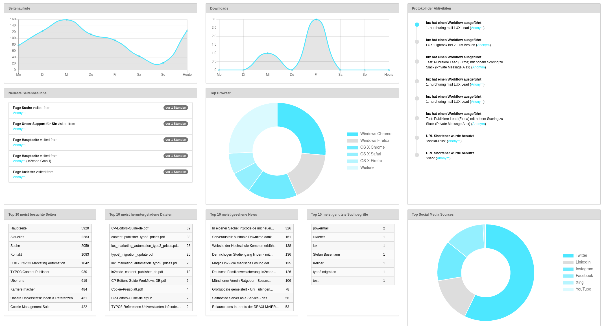

# Living User eXperience - LUX - the Marketing Automation tool for TYPO3

## Introduction

LUX is an enterprise software solution to fill the gap between your TYPO3-website and a standalone marketing automation
tool. LUX will track, identify, analyse your leads and give the visitors some improved user experience for your website
like showing relevant information at the right time.
LUX will not set any cookies.

## Screenshots

TYPO3 dashboard (for TYPO3 10 with package "typo3/cms-dashboard"):\
\

Example dashboards:\
\

Example leadlist:\
\

Show some details:\
\

Show relevant information in page view:\
\

Workflow - Define your own trigger(s) and combine them via AND or OR (Enterprise version only):\
\

Workflow - Do one or more Actions if a trigger is activated (Enterprise version only):\
\

Ask for the visitors email-address when he/she wants to download an asset:\
\

... with a CK editor plugin:\
\

## What's new

### in 9.0.0

* Lux introduced Link Listeners with Frontend and Backend functionality
** Use an additional analyses module for Link Listeners
** Increase category scoring for visitors when clicking on a "call to action"

### in 8.0.0

* TYPO3 language will be tracked now
* News (tx_news) visits will be tracked now
* Domains will be saved now (for multi-domain usage)
* Full dynamical diagrams in all views with filters
* A general UX update for nearly all views
* Multiple referrers can be stored now (see upgrade wizard)
* Images from leads are now cached for better performance

### in 7.0.0

* TYPO3 10 general support (with new TypoScript conditions, symfony Commands, MailMessage class for 9 and 10)
* Replace cookieID with fingerprinting method (no more cookies for identification) - multi domain and platform identification
* Replace functional cookies with local storage records (no more functional cookies)
* Add a lot of dashboard widgets
* Performance feature
* Update documentation with new stuff

## Documentation

See the full [documentation](Documentation/Index.md) (technical, marketing and privacy)

## Features

### Extensions for lux

* luxenterprise for individual workflows: https://www.in2code.de/produkte/lux-typo3-marketing-automation/
* luxletter for email marketing aspects: https://github.com/in2code-de/luxletter

### Tracking

* Page views
* News views
* Number of website visits
* Pagefunnel
* First and last visit
* Store attributes from any form on the website
* Enrich information via IP: Country, Region, Company
* Track any asset download

### Identification

* Identify a lead with any webform email field
* Identify a lead while listening to complete form submits
* Offer via CkEditor plugin a email4link popup (give me your email and we are going to send you the asset via email)
* Identify a lead via click in a newsletter email sent by [Extension luxletter](https://github.com/in2code-de/luxletter)
* Identify a lead automatically via frontend login
* Automatically merge legacy cookie-ids or different fingerprints on new identifications
* Multi-Domain, Multi-Device and Multi-Platorm tracking

### Analyses

* TYPO3 Dashboard supported
* Last leads per page
* Dashboard (most important information)
* Listview
* Detailview with pagefunnel and activity-log
* Show pageviews
* Show asset downloads

### Scoring

* General scoring (with individual calculation)
* Category Scoring
* Contextual content (based on category scoring)

### Workflow & User Experience (Enterprise version only)

* Workflow backend module with a GUI and easy extension possibility
* Triggers:
  * On page visit (define on which number of pagevisit)
  * On a minimum scoring
  * When lead reaches a categoryscoring
  * When lead enters a page of a given category
  * If in a time frame
  * If a lead gets identified
  * If lead company given
  * Use your own expressions for doing even mor individual stuff (with Symfony Expression Language)
  * Limit to a start action (page visit, download, form submit, etc...)
* Actions:
  * Lightbox with a content element
  * Load a content element and show it on the current page
  * Hide or show an element of the current page
  * Send an email with lead details
  * Redirect to any URL
  * Send publication to a slack channel
  * Send lead to your CRM via interface connection
  * Blacklist a visitor

### CommandControllers & Scheduler

* Anonymize leads (for presentations or local development)
* Cleanup commands (to really erase data from database)
  * Remove all visitors
  * Remove all visitors by age
  * Remove unknown visitors by age
  * Remove a defined visitor by uid
  * Remove visitors by a given property
* Lead commands to get a summary mail for your sales team
  * Send an overall summary
  * Send a summary mail with known companies
  * Send a summary mail by a lux category
* Service commands (calculate scoring for all leads)

### Privacy Features

* There is a plugin which allows the visitor to opt-out from tracking
* It's also possible to use opt-in instead of opt-out
* The doNotTrack header of the browser will be respected (hardcoded - no change to overrule this!)
* Toogle IP anonymize function
* Toggle IP information enrichment over ipapi.com
* Toggle Tracking of Pagevisits
* Toggle Tracking of Downloads
* Toggle Field identification of any form
* Toogle Email4link functionality
* CommandController to anonymize records (for developing or for a presentation)
* Blacklist functionality
* Workflow blacklist action

### Upcoming todos

* Channel detection with individual GET-params like &lc=emailsignature or &lc=googleadscampaign1
* Crawler detection e.g. jaybizzle/crawler-detect in StopTracking.php

### Possible Enterprise Features in the future

* Todo: Contacts (Import?)
* Todo: API (Im- and Export)
* Todo: A/B Tests
* Todo: SocialMedia Connection (Twitter)

Interested? Call us!

## Technical requirements

lux needs minimum *TYPO3 9.5* as a modern basic together with *composer mode*. Every kind of form extension is supported
for the identification feature (powermail, form, formhandler, felogin, etc...).
At the moment it's not possible to use lux without **composer mode**!

## Breaking changes !!!

| Version                     | Situation                                           | Upgrade instructions                                                                                                                                                                      |
| --------------------------- | --------------------------------------------------- | ----------------------------------------------------------------------------------------------------------------------------------------------------------------------------------------- |
| From former versions to 8.x | Referrers are stored on a different place now       | Call your TYPO3 upgrade wizard. There will be one more step that will copy values from _visitor.referrer to _pagevisit.referrer table.                                                    |
| From former versions to 7.x | Cookie-Table was replaced with a Fingerprint-Table  | Call your TYPO3 upgrade wizard. There will be one more step that will copy values from _idcookie to _fingerprint table. Note that CommandControllers are replaced by Symfony Commands!    |
| From former versions to 3.x | The visitor object can handle more cookies now      | After updating use the update button in extension manager of if you have a lot of data stored, you can also use the LuxUpdateCommandController to prevent timeouts                        |

## Changelog

| Version    | Date       | State      | Description                                                                                                                                                                                |
| ---------- | ---------- | ---------- | ------------------------------------------------------------------------------------------------------------------------------------------------------------------------------------------ |
| 16.0.2     | 2021-08-20 | Task       | Update disallowed mail providers, update documentation.                                                                                                                                    |
| 16.0.1     | 2021-08-20 | Task       | Adjust lux icon size in frontend for email4link lightbox to a smaller variant.                                                                                                             |
| 16.0.0     | 2021-08-16 | Feature    | Add a search view for a websearch analysis. Harden RTE default configuration.                                                                                                              |
| 15.3.1     | 2021-08-16 | Bugfix     | Fix SQL error "Expression #1 of ORDER BY clause is not in SELECT list" on some circumstances.                                                                                              |
| 15.3.0     | 2021-08-12 | Task       | Show a "powered by Lux" in email4link if luxenterprise is not installed. Also show a "go enterprise" in page module.                                                                       |
| 15.2.2     | 2021-08-10 | Bugfix     | Allow more then 255 characters for pagevisit.referrer now, simplify start/endtime TCA configuration, hide searchterm table in list view.                                                   |
| 15.2.1     | 2021-08-06 | Bugfix     | Add dashboard resources only if typo3/cms-dashboard is installed.                                                                                                                          |
| 15.2.0     | 2021-07-27 | Feature    | Add GET param configuration for a search with extension ke_search by default in addition to solr and indexed_search.                                                                       |
| 15.1.0     | 2021-07-11 | Feature    | Continous integration update: Test for code quality and run unit tests on every push and pull request now.                                                                                 |
| 15.0.3     | 2021-07-06 | Task       | Remove outdated JS function for registering third party functions that can be called after fingerprint is ready calculated.                                                                |
| 15.0.2     | 2021-07-06 | Bugfix     | Fix possible exception if browser version is not readable. Fix getAnyPropertyByName() function in visitor model.                                                                           |
| 15.0.1     | 2021-06-30 | Task       | Manual OptIn hardened. Now it can be called multiple times (if called twice from cookie banner). See privacy documentation for a manual OptIn (with fingerprint or with localstorage).     |
| 15.0.0     | 2021-06-28 | Feature    | Decide if you want to use fingerprint or localstorage as basic tracking method now. Localstorage is interesting for b2c while fingerprint is more for b2b (see installation documenation). |
| 14.4.2     | 2021-06-24 | Bugfix     | Show correct number of newsvisits in dashboard and news module                                                                                                                             |
| 14.4.1     | 2021-06-23 | Task       | Define which error should not be logged now. Per default a bot recognition (e.g.) should not be logged.                                                                                    |
| 14.4.0     | 2021-06-22 | Feature    | Add exception/error logging for frontend requests                                                                                                                                          |
| 14.3.2     | 2021-06-17 | Bugfix     | Fix possible sql exception in additional modules (news and linkclick analysis) together with SQL strict mode                                                                               |
| 14.3.1     | 2021-06-15 | Bugfix     | Fix possible sql exception in modules together with SQL strict mode                                                                                                                        |
| 14.3.0     | 2021-06-07 | Feature    | Performance update for lead list in backend                                                                                                                                                |
| 14.2.0     | 2021-05-26 | Feature    | Preperation for push messages in frontend                                                                                                                                                  |
| 14.1.0     | 2021-05-26 | Feature    | Performance update: To allow handling of more pagevisits data (in all three dashboards)                                                                                                    |
| 14.0.3     | 2021-05-12 | Bugfix     | Don't minify already minified JS (to prevent errors - e.g. with EXT:min), Really show the latest visitors in PageOverview                                                                  |
| 14.0.2     | 2021-05-11 | Bugfix     | Respect if EXT:news is not present. Update disallowedEmailProvider list.                                                                                                                   |
| 14.0.1     | 2021-05-10 | Bugfix     | Prevent errors in log related to image grabber. Update documentation. Default status for PageOverview switched.                                                                            |
| 14.0.0     | 2021-05-08 | Feature    | Rework of the pageoverview layout. Now it can be shown or hidden by each editor.                                                                                                           |
| 13.4.2     | 2021-05-07 | Bugfix     | Fix TCA for linkclick records                                                                                                                                                              |
| 13.4.1     | 2021-05-04 | Task       | Add a css class for closing icons in backend context                                                                                                                                       |
| 13.4.0     | 2021-05-01 | Feature    | Add two news viewhelpers that can be used now, update documentation                                                                                                                        |
| 13.3.0     | 2021-04-30 | Feature    | Unify all analysis detail views now with cropped titles and with fingerprint and location values                                                                                           |
| 13.2.0     | 2021-04-26 | Feature    | New getter for any property, Add relation to fe_users automatically, Fe_users relation command, Email4Link more general with any fields, Documentation update                              |
| 13.1.0     | 2021-04-25 | Feature    | Show news title beside page title (if news), add relation between news- and pagevisit to save to store domain in newsvisit, small bugfix in backlink                                       |
| 13.0.0     | 2021-04-12 | Feature    | Add a complete new view to analyse news visitors (if extension news is installed)                                                                                                          |
| 12.0.0     | 2021-04-08 | Feature    | Filter by domain in analysis module now, more debugging information in browser console                                                                                                     |
| 11.8.0     | 2021-03-25 | Feature    | Show language after page title in all diagrams in backend                                                                                                                                  |
| 11.7.1     | 2021-03-17 | Task       | Add extension name to composer.json                                                                                                                                                        |
| 11.7.0     | 2021-03-11 | Feature    | Show full userAgent on hover, ignore "HeadlessChrome" visits, small improvements of stopTacking function, small documentation update, bugfix on page detail view for ajax links            |
| 11.6.0     | 2021-03-10 | Feature    | Ignore browsers with user agent "cookieradar" - so our product (see https://www.in2code.de/produkte/cookie-managment-suite/) is not tracked any more                                       |
| 11.5.0     | 2021-03-01 | Feature    | Add new getters in fingerprint model for specific user agent properties (that can be used in workflow fluid templates)                                                                     |
| 11.4.0     | 2021-02-26 | Feature    | Don't add fieldlistener events to uninteresting fields (hidden, submit), update documentation FAQ                                                                                          |
| 11.3.2     | 2021-02-16 | Task       | Updated telecommunication provider list                                                                                                                                                    |
| 11.3.1     | 2021-02-12 | Bugfix     | Remove also related search words if a visitor gets removed                                                                                                                                 |
| 11.3.0     | 2021-01-28 | Feature    | Add "identified only" checkbox to lead list, add number of results to lead list, save searchterms only lowercase (for better comparing)                                                    |
| 11.2.1     | 2021-01-15 | Bugfix     | Prevent exception when filtering in backend                                                                                                                                                |
| 11.2.0     | 2021-01-04 | Feature    | Add a configuration for auto-publishing new tags to TER, updated telecommunication provider list                                                                                           |
| 11.1.0     | 2020-12-16 | Feature    | Add wizards for top news and top search terms to TYPO3 dashboard, better bot detection (to stop tracking)                                                                                  |
| 11.0.0     | 2020-12-14 | Feature    | Track and show searchterms on your website now (solr or indexed search)                                                                                                                    |
| 10.3.3     | 2020-12-03 | Bugfix     | Fix a copy and paste failure in TS configuration for formMapping settings                                                                                                                  |
| 10.3.2     | 2020-11-26 | Bugfix     | Four different bugfixes related to backend view filtering, scoring calculation and output for "last page visit"                                                                            |
| 10.3.1     | 2020-11-11 | Bugfix     | Add a missing log status translation                                                                                                                                                       |
| 10.3.0     | 2020-11-11 | Feature    | Allow a bcc setting for email4link                                                                                                                                                         |
| 10.2.0     | 2020-11-05 | Feature    | Show complete fingerprint in debug mode in browser console. Fix randomized fingerprints in email4link function.                                                                            |
| 10.1.0     | 2020-10-01 | Feature    | Allow email4link without optin or with doNotTrack headers, Show helpful console outputs in debug mode.                                                                                     |
| 10.0.2     | 2020-08-07 | Bugfix     | Fix else statements in TypoScript conditions                                                                                                                                               |
| 10.0.1     | 2020-08-07 | Bugfix     | Don't cache redirect view                                                                                                                                                                  |
| 10.0.0     | 2020-07-10 | Feature    | Social media performance diagram, add internal redirect service, update disallowed provider list, preperations for URL shortener (part of the enterprise version)                          |
| 9.1.2      | 2020-06-24 | Bugfix     | Fix type for linkclick configuration in TCA and Model                                                                                                                                      |
| 9.1.1      | 2020-06-22 | Task       | Reduce requirements for symfony/expression-language to allow TYPO3 9 and form extension                                                                                                    |
| 9.1.0      | 2020-06-19 | Feature    | Don't track some more bots                                                                                                                                                                 |
| 9.0.0      | 2020-05-31 | Feature    | Introduce Link Listeners                                                                                                                                                                   |
| 8.2.2      | 2020-05-25 | Bugfix     | Don't create new visitor records when unneeded in additional languages, don't show empty log entry when merging visitors                                                                   |
| 8.2.1      | 2020-05-17 | Bugfix     | Broken table definition of the not yet needed table tx_lux_domain_model_linkclick causes some trouble on database compare                                                                  |
| 8.2.0      | 2020-05-13 | Feature    | Show content diagrams per hour if timeframe is maximum 1 day, Performance update for Analysis/Content/PageDetail view                                                                      |
| 8.1.1      | 2020-05-13 | Bugfix     | Don't track image views as downloads, Define wich log status should be shown in backend                                                                                                    |
| 8.1.0      | 2020-05-12 | Feature    | Static CSV with IP2Company list possible, Merge visitors with same fingerprint, Take oldest visitor record on duplicates                                                                   |
| 8.0.1      | 2020-05-11 | Bugfix     | Fix some typehint exceptions with empty filter in Analysis/Content                                                                                                                         |
| 8.0.0 !!!  | 2020-05-10 | Task       | A basic UX update, store news views, languages and domains now.                                                                                                                            |
| 7.3.0      | 2020-04-27 | Task       | Ignore browser version when calculating a fingerprint. Small bugfix with deleting old cookies.                                                                                             |
| 7.2.3      | 2020-04-22 | Bugfix     | Add css class in backend modules to fix view in TYPO3 10.4.                                                                                                                                |
| 7.2.2      | 2020-04-21 | Bugfix     | Change mimetypes of dynamically generated Javascript from application/javascript to text/javascript for older browsers.                                                                    |
| 7.2.1      | 2020-04-20 | Bugfix     | Support content in popups also with typenum in siteconfiguration (only relevant for in2code/luxenterprise). Small cleanup.                                                                 |
| 7.2.0      | 2020-04-17 | Task       | Update for TYPO3 10.4 LTS and it's dashboard breaking changes.                                                                                                                             |
| 7.1.0      | 2020-04-03 | Feature    | Allow errorhandling in workflows and finishers now.                                                                                                                                        |
| 7.0.2      | 2020-04-03 | Bugfix     | In some cases fingerprints are not calculated in time: Extend time and don't track if there is an empty fingerprint.                                                                       |
| 7.0.1      | 2020-03-27 | Bugfix     | Version of luxletter could not detected correctly. Only relevant if lux was used with luxletter.                                                                                           |
| 7.0.0 !!!  | 2020-03-21 | Task       | Support TYPO3 10 and new dashboard module. Don't set cookies any more. Recognize visitors by fingerprinting now. Performance update.                                                       |
| 6.3.0      | 2019-09-14 | Task       | Small update of the telecommunication provider list                                                                                                                                        |
| 6.2.0      | 2019-08-27 | Feature    | Updated disallowed mail provider list and updated telecommunication provider list                                                                                                          |
| 6.1.0      | 2019-08-14 | Feature    | Stop tracking of google bots before records get persisted, add some new signals, small cleanup                                                                                             |
| 6.0.0      | 2019-08-10 | Feature    | New dashboard views: Add identified leads per month, add overall statistics, Html refactoring, Don't show wrong default image for leads, New VH for luxenterprise, Documentation update    |
| 5.1.0      | 2019-08-08 | Task       | Performance update lead list, Keep filter, Don't show duplicates in page content, Add new task to delete a visitor by any property, Disallowed mail providers update, Cleanup tasks bugfix |
| 5.0.0      | 2019-07-31 | Task       | Opt-in functionality, Luxletter support, Identification via frontend-login                                                                                                                 |
| 4.1.2      | 2019-07-25 | Bugfix     | Fix email4link email sending functionality on some edge cases                                                                                                                              |
| 4.1.1      | 2019-07-13 | Bugfix     | Bugfix for PHP 7.3 - Fluid errors in backend modules                                                                                                                                       |
| 4.1.0      | 2019-07-07 | Task       | Toggle ckeditor configuration, don't add if ckeditor is not installed, fix typo                                                                                                            |
| 4.0.0      | 2019-06-14 | Task       | Include concept of finishers, don't ask again if identified with email4download                                                                                                            |
| 3.0.0 !!!  | 2019-06-10 | Task       | Multi device tracking, form listening, show browser and os information of leads                                                                                                            |
| 2.5.0      | 2019-06-04 | Task       | Some preperations for luxenterprise                                                                                                                                                        |
| 2.4.0      | 2019-06-03 | Feature    | Replace eos with expression-language, Add url f. workflows, doc update, php cleanup                                                                                                        |
| 2.3.1      | 2019-05-20 | Bugfix     | Show correct last visited date in lead list in backend                                                                                                                                     |
| 2.3.0      | 2019-04-17 | Feature    | Move client to serverside check for disallowed mail providers, small fixes                                                                                                                 |
| 2.2.0      | 2019-03-07 | Feature    | Show status in extension manager settings, Show lead name of unidentified leads                                                                                                            |
| 2.1.0      | 2019-03-07 | Task       | Small cleanup, Update and use case-insensitive search in telecom provider list                                                                                                             |
| 2.0.3      | 2019-02-26 | Bugfix     | Show module action switcher in T3 9.5, remove unneeded stuff from former releases                                                                                                          |
| 2.0.2      | 2019-02-25 | Bugfix     | Small bugfix for TER uploads                                                                                                                                                               |
| 2.0.1      | 2019-02-25 | Bugfix     | Small fixes with default values if configuration is missing                                                                                                                                |
| 2.0.0      | 2019-02-24 | Task       | Publish lux as community version (without Workflows), removeAll CommandController                                                                                                          |
| 1.24.0     | 2018-11-07 | Task       | Update disallowed telecommunication provider list                                                                                                                                          |
| 1.23.0     | 2018-08-17 | Task       | Update disallowed mail provider and telecommunication list                                                                                                                                 |
| 1.22.0     | 2018-07-23 | Task       | Update disallowed mail provider list                                                                                                                                                       |
| 1.21.1     | 2018-06-28 | Task       | Code cleanup, update telecommunication provider list, performance improvement                                                                                                              |
| 1.21.0     | 2018-06-28 | Task       | Add blacklist function for onetime-email-accounts in email4link functionality                                                                                                              |
| 1.20.3     | 2018-05-24 | Task       | Update privacy link in a new tab.                                                                                                                                                          |
| 1.20.2     | 2018-05-24 | Task       | Small locallang update.                                                                                                                                                                    |
| 1.20.1     | 2018-05-24 | Bugfix     | Small documentation update.                                                                                                                                                                |
| 1.20.0     | 2018-05-24 | Feature    | Bugfixes, Privacy checkbox in email4link, Manual blacklisting.                                                                                                                             |
| 1.19.0     | 2018-04-24 | Task       | Documentation update. Telecommunication provider list update.                                                                                                                              |
| 1.18.0     | 2018-04-21 | Feature    | Introduce summary-mails in command controller.                                                                                                                                             |
| 1.17.0     | 2018-04-12 | Feature    | Publish to multiple slack channels now.                                                                                                                                                    |
| 1.16.1     | 2018-04-12 | Bugfix     | Fix for chrome select boxes in workflow module, fix filter select in content view.                                                                                                         |
| 1.16.0     | 2018-04-12 | Feature    | Show company from IP-address on different places. Add company trigger.                                                                                                                     |
| 1.15.1     | 2018-04-04 | Bugfix     | Allow links in lightboxes now.                                                                                                                                                             |
| 1.15.0     | 2018-04-04 | Task       | Add documentation, Dashboard: Show percentual values. Performance in content view.                                                                                                         |
| 1.14.0     | 2018-03-26 | Bugfix     | Small bugfixes (CKeditor Plugin, Dateformat)                                                                                                                                               |
| 1.13.2     | 2018-03-18 | Bugfix     | Small bugfixes.                                                                                                                                                                            |
| 1.13.1     | 2018-03-15 | Bugfix     | Small bugfixes.                                                                                                                                                                            |
| 1.13.0     | 2018-03-14 | Task       | Add css grid for dashboard. Small bugfixes.                                                                                                                                                |
| 1.12.0     | 2018-03-13 | Feature    | Disable tracking if be-user is logged in. Small bugfixes.                                                                                                                                  |
| 1.11.0     | 2018-03-12 | Feature    | Some privace features. Some brush up. Add contextual content plugin.                                                                                                                       |
| 1.10.0     | 2018-03-10 | Task       | Some small improvements. Add a opt-out plugin.                                                                                                                                             |
| 1.9.0      | 2018-03-08 | Task       | Some changes to see categoryscorings.                                                                                                                                                      |
| 1.8.0      | 2018-03-07 | Feature    | Optical refactoring of pageoverview. Bugfix in category scoring.                                                                                                                           |
| 1.7.0      | 2018-03-07 | Feature    | Add identified trigger and slack action.                                                                                                                                                   |
| 1.6.0      | 2018-03-06 | Task       | Add categoryscoring. Bugfix: Don't track downloads with email4link twice.                                                                                                                  |
| 1.5.1      | 2018-03-05 | Bugfix     | Prevent exception in backend.                                                                                                                                                              |
| 1.5.0      | 2018-03-05 | Task       | Finish workflow modules with initial triggers/actions. Small bugfixes.                                                                                                                     |
| 1.4.0      | 2018-03-04 | Task       | Split backend modules, add content analysis, integrate nearly complete workflow                                                                                                            |
| 1.3.0      | 2018-03-02 | Task       | Don't show full download path in frontend with email4download                                                                                                                              |
| 1.2.0      | 2018-03-01 | Task       | Some small fixes in backend analysis show identified and recurring.                                                                                                                        |
| 1.1.1      | 2018-02-27 | Bugfix     | Some small fixes in backend analysis and email4link functionality.                                                                                                                         |
| 1.1.0      | 2018-02-26 | Task       | Show more relevant information in detail view. Small fixes.                                                                                                                                |
| 1.0.1      | 2018-02-26 | Bugfix     | Fix some smaller bugs that occurs with live data                                                                                                                                           |
| 1.0.0      | 2018-02-26 | Task       | Initial Release with a stable tracking, identification and analyses                                                                                                                        |
